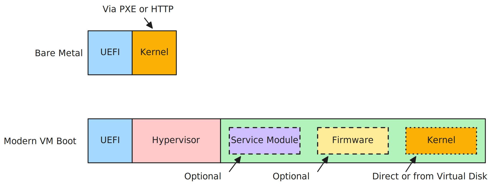

# Motivation

PMI exists to solve three problems with how virtual-machine images
are produced and consumed today. Each problem maps to one PMI goal
and one or more methods PMI uses to deliver it.

| # | Problem                                                  | Goal                                              |
| - | -------------------------------------------------------- | ------------------------------------------------- |
| 1 | One workload needs multiple image artifacts              | [Executable format portability](#executable-format-portability) |
| 2 | Existing solutions are target-specific and don't compose | [Uniform approach across targets](#uniform-approach-across-targets) |
| 3 | Every new image format needs new tools at every layer    | [Tooling reuse](#tooling-reuse)                   |

PMI is intentionally narrow. Higher-level concerns — platform
identity, host-conformance checking, attestation policy, the
measured-vs-unmeasured boundary as a security argument — are the
business of upper-layer specs (e.g., dillo) that build on top of
PMI. PMI provides the substrate: the PE container, target-specific
CBOR launch recipes, the action mechanism that drives firmware
ABIs, and a namespacing rule for upper-layer extensions.

## 1. One workload needs multiple image artifacts

A single Linux workload — the same kernel, initrd, and command
line — is increasingly expected to run in many shapes: bare metal
under UEFI; as a direct-boot VM where the VMM extracts the kernel;
under guest firmware (OVMF) that loads the kernel from a virtual
disk; under a confidential VMM with a service module (COCONUT-SVSM,
a paravisor) that initializes the confidential environment before
the firmware sees it. The boot pipeline differs per shape:

For an image author distributing a workload, the natural unit is
"one artifact." The artifact gets pulled from a registry, cached,
signed once, scanned once, attested once, and referenced by one
content hash. Anything that splits it into multiple artifacts
duplicates that whole pipeline. Real deployments span the spectrum:

- `qemu -kernel image.efi` — VMM extracts the kernel directly via
  the Linux boot protocol; no firmware involved.
- `qemu -bios OVMF.fd -kernel image.efi` — OVMF runs as guest UEFI
  and boots the kernel from the PE.
- `qemu -bios OVMF.fd -drive file=disk.img,...` — OVMF loads the
  kernel from a virtual disk; the PE need not carry one.
- COCONUT-SVSM + OVMF under SEV-SNP — the VMM launches the SVSM at
  VMPL0, which initializes the confidential environment, exposes a
  vTPM, and transitions OVMF to VMPL1.
- UEFI on bare metal via PXE or HTTP Boot — firmware fetches the PE
  remotely; the EFI stub boots the kernel.

Existing image formats are shape-specific. PE/UKI assumes UEFI
loads the image and runs an EFI stub. The Linux boot protocol
assumes the VMM extracts the kernel. IGVM assumes a paravisor-
style confidential boot with measurement metadata. An image author
who wants to support more than one shape today produces more than
one artifact, with parallel build paths, parallel signing flows,
parallel registries to push to, and parallel rules to teach
deployers about which artifact to pull for which shape.

A service module (COCONUT-SVSM, paravisor) is a CC-specific
privileged component that initializes the confidential environment
and exposes services such as a vTPM before dropping the guest
firmware to a lower privilege level; it is absent from bare metal
and non-CC VM boot.

### Executable format portability

A PMI image is one PE binary. The PE container is universally
understood by PE-based loaders (UEFI, Windows, Wine). PMI's
extension to PE is a set of non-loaded sections whose names begin
with `.pmi.` — one per launch target the image supports. Because
these sections are flagged `IMAGE_SCN_MEM_DISCARDABLE`, PE loaders
that do not know about PMI ignore them. The same image bytes
therefore boot:

- on bare metal, where UEFI executes the UKI-style EFI stub
- under a non-CC VMM, which reads `.pmi.vm` and follows its recipe
- under a confidential VMM, which reads `.pmi.sev` / `.pmi.tdx` /
  `.pmi.cca` and follows its recipe

PMI is compatible with UKI, not a flavor of it. An image that
contains only firmware (for OVMF-loads-kernel-from-disk modes), or
only confidential-VM content, is equally valid.

The mechanism: **PE-as-base**. PMI extends PE without replacing it.
See [pe.md](pe.md) for the alignment and section-naming rules that
keep this invisible to existing PE tools.

## 2. Existing solutions are target-specific and don't compose

Each CC architecture and major hypervisor stack has independently
noticed that VM launch needs a launch recipe — a way to tell the
VMM how to assemble the guest, what bytes go where, what firmware
calls to make, in what order — and each has rolled its own answer:

- **Intel TDX defines HOB (Hand-Off Block)** as a per-target
  mechanism for the host to hand platform information to the
  guest. The mechanism only applies inside TDX.
- **IGVM (Microsoft)** is a hypervisor-anchored image format for
  paravisor-style confidential boots. It addresses a slice of the
  artifact-sprawl problem for that one boot shape, but doesn't
  extend to non-paravisor confidential boot, non-CC VM, bare
  metal, or to CC targets outside its scope.
- **QEMU has ad-hoc conventions** for SEV id-block / CPUID page /
  VMSA submission; libkrun does it differently; each cloud
  hypervisor has its own variant. None of them port.
- **Each VMM rolls its own measurement-reproduction tool** for its
  own targets. Each one has to be separately maintained,
  separately hardened, separately validated against attestation
  reports.
- **Each VMM exposes its own knobs** for choosing CPU feature
  exposure, configuring NUMA topology, signing tenant identity.
  Image authors learn N idiosyncratic surfaces.

Each of these is a target-specific or hypervisor-specific attempt
at the same general class of problem. The result: even where
individual problems are partly addressed, the solutions don't
compose. A workload that wants to run SEV on AWS, TDX on Azure,
and CCA on a tenant-owned bare-metal Arm box needs three different
image-build paths, three different verifier integrations, three
different consumer stubs. An image author supporting two CC
architectures effectively maintains two image-format toolchains in
parallel.

### Uniform approach across targets

PMI uses the same shape for every target. An image author who
supports `vm`, `sev`, `cca`, and `tdx` writes the same CBOR
structure with the same action types ([`load`](load.md),
[`fill`](fill.md)), the same byte-section pattern for
vendor-defined blobs, and the same encoding and ordering rules.
The per-target chapters differ only in their target-specific
deltas: what kinds of `load` and `fill` mean, which vendor
structures get carried as byte sections, what the underlying
firmware does with each action.

This means an image author learns one format and ships one image
to N targets; a consumer parses one CBOR shape regardless of which
target it's running under; tools (parser, signer, inspector) work
uniformly across targets.

Native vendor differences (SEV-SNP's launch digest vs. CCA's RIM
vs. TDX's MRTD, AMD's id-block vs. CCA's RPV vs. TDX's MRCONFIGID,
the firmware ABIs each target rides) are preserved — PMI is a
framework on top of native target semantics, not a replacement for
them.

The mechanisms: **self-contained byte sections** (vendor blobs
ride as opaque PE sections, not marshaled into CBOR) and
**pinned encoding and ordering** (CBOR per RFC 8949 Core
Deterministic Encoding; actions in array order; pages from lowest
to highest GPA within each action). Together they let any tool
agree byte-for-byte on what the spec says and what the VMM submits
to firmware.

## 3. Every new image format needs new tools at every layer

Image formats are not consumed by one piece of software. A single
format gets touched by:

- **Producers** that build images from source artifacts (kernels,
  initrds, command lines, signatures).
- **Consumers** that load images and execute them (VMMs, in-guest
  pre-kernel stubs, UEFI firmware).
- **Verifiers** that reproduce the expected attestation from the
  image bytes.
- **Inspectors** that answer "what will this image do?" for
  debugging, auditing, registry display, and CI gating.
- **Signers** that bind a tenant or vendor identity to the
  artifact and producers/verifiers of those signatures.
- **Long-tail tooling** — strippers, disassemblers, registry
  layer introspectors — that touch images without understanding
  their full semantics.

Each of these layers represents accumulated engineering effort for
existing formats. PE has `objcopy`, `objdump`, `sbsign`, `pesign`,
`systemd-ukify`, `systemd-stub`, every UEFI loader, and decades of
hardening. A new image format that abandons PE forces every layer
to be re-implemented; bugs found in one stack don't fix the
others, and the new tooling lacks the operational maturity of
what it replaced.

A new format that extends PE rather than replacing it inherits the
existing ecosystem for the layers that don't change, and only has
to introduce new tooling for the genuinely new concerns. But that
new tooling has its own constituency: a target-spec parser is
wanted by producers, VMMs, in-guest consumers, verifiers, and
inspectors; a tenant-identity signer is wanted by image authors
and deployers. If each new tool is bound tightly to one
application, the same conceptual work gets re-implemented per
consumer, and the format ends up with N tools each doing one job
badly instead of one tool doing the job well.

### Tooling reuse

PMI is shaped so existing PE-based tools (`objcopy`, `objdump`,
`sbsign`, `ukify`, `systemd-stub`, UEFI loaders) work on PMI
images unchanged. PMI uses no novel PE features; PE-aware tools
that strip `IMAGE_SCN_MEM_DISCARDABLE` sections by default are
the only known hazard.

New PMI-specific tools are shaped to have narrow contracts and
compose across contexts:

- The target-spec parser is reusable in builders, VMMs, in-guest
  consumers, verifiers, OCI inspectors, and debuggers.
- A tenant-identity signer (e.g., for SEV id-block / id-auth) is
  reusable across image authors and tenants.
- Per-target VMM logic composes across hypervisors (KVM, HVF,
  WHP, future ports) because every conformant VMM reads the same
  wire format and applies the same rules.

The mechanism is the same **PE-as-base** strategy from goal (1),
applied at the tooling layer: keep the substrate the existing
toolchain already understands; add only what's genuinely new.
