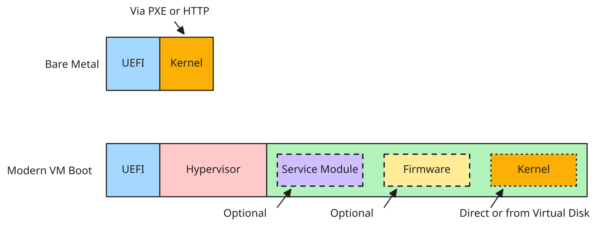

# Portable Machine Image (PMI) Version 1.0

## Working Draft 01 (pre-submission)

> No OASIS Technical Committee has been formed for PMI. This document is a
> pre-submission working draft, formatted to the OASIS specification template in
> anticipation of contributing it to a future TC. It carries no standing, is
> subject to change without notice, and **MUST NOT** be cited as an OASIS
> Standard, Committee Specification, or Committee Specification Draft. The
> OASIS-template boilerplate below (title-page metadata, Annex A license and
> notices) is scaffolding for that future submission and does not assert that
> OASIS has adopted or endorsed this work.

## [ DD ] [ Month ] [ YYYY ]

<!-- EDITOR NOTE: The date above is a placeholder with no formal meaning until an
OASIS TC adopts this draft; once a TC exists it MUST be the date the work product
was approved by the TC. -->

<!-- EDITOR NOTE: This is a pre-submission Working Draft. The OASIS logo has been
intentionally omitted because this is not (yet) an OASIS work product; the OASIS
trademark must not appear until the work is contributed to an OASIS TC. -->


### This version

- [ link to authoritative version of the published document ] (Authoritative)
- [ links to one or more other versions (MD, PDF, Word, HTML, etc.) ]

### Previous version

- N/A

### Latest version

- [ link to authoritative version of the published document ] (Authoritative)
- [ links to one or more other versions (MD, PDF, Word, HTML, etc.) ]

### Technical Committee

[ The full name of the OASIS Technical Committee, linked to its landing page ]

### Chairs

- [ First Name Last Name (email), Company ]

### Secretaries

- [ First Name Last Name (email), Company ]

### Editors

- Nathaniel McCallum (nathaniel.mccallum@amd.com), AMD

### Related work

This specification is derived from the Portable Machine Image (PMI) draft
maintained at `https://github.com/pichi-vm/pmi`.

This document is related to:

- [ The full reference to any related document in IEEE reference format ]

### Abstract

Portable Machine Image (PMI) is a file format for distributing an operating
system's early boot code — Linux kernels, guest firmware, bootloaders,
paravisors, and Confidential Computing service modules — as a single artifact
that boots unchanged on bare metal, in a traditional virtual machine, and in a
confidential virtual machine on AMD SEV-SNP, Intel TDX, and Arm CCA. PMI is an
additive layer on the Portable Executable (PE) format: it adds non-loaded PE
sections that a PMI-aware Virtual Machine Monitor (VMM) reads to compose and
launch a guest, and that non-PMI loaders ignore. PMI moves the declaration of
the guest platform — CPU features, initial register state, platform
description, and first-executed bytes — from the host into the measured image,
so that a compliant VMM produces a byte-identical launch measurement regardless
of which host or hypervisor provisioned the machine. This specification defines
the PMI core (the target shape, launch model, validation rules, and the `load`
and `fill` actions) together with the registered extensions that make it usable:
`cpu`, `vm`, `dt`, `sev`, `tdx`, and `cca`.

### Citation format

When referencing this document, the following citation format should be used:

**[PMI-v1.0]**
*Portable Machine Image (PMI) Version 1.0*. Edited by Nathaniel McCallum. [ DD Month
YYYY ]. Working Draft (pre-submission; not an OASIS deliverable). [ authoritative
URL ]. Latest version: [ latest-version URL ].

## License, Document Status, and Notices

For license and copyright information, and complete status, please see Annex A
which contains the License, Document Status and Notices.

<!-- EDITOR NOTE: This pre-submission Working Draft is distributed under the
license of its source repository (https://github.com/pichi-vm/pmi). The OASIS
copyright and IPR terms reproduced in Annex A apply only once the work is
contributed to an OASIS TC; no OASIS copyright is asserted here. -->


---

## Table of Contents

- [1 Scope](#1-scope)
- [2 Definitions and Acronyms](#2-definitions-and-acronyms)
  - [2.1 Definitions](#21-definitions)
    - [2.1.1 Terms Defined Elsewhere](#211-terms-defined-elsewhere)
    - [2.1.2 Terms Defined in This Document](#212-terms-defined-in-this-document)
  - [2.2 Abbreviations and Acronyms](#22-abbreviations-and-acronyms)
- [3 Document Conventions](#3-document-conventions)
  - [3.1 Key Words](#31-key-words)
  - [3.2 Typographical Conventions](#32-typographical-conventions)
- [4 Introduction](#4-introduction)
  - [4.1 Portability Across Targets](#41-portability-across-targets)
  - [4.2 Portable, Safe Platform Definition and Attestation](#42-portable-safe-platform-definition-and-attestation)
  - [4.3 Reuse of Existing Tooling and Formats](#43-reuse-of-existing-tooling-and-formats)
  - [4.4 What a PMI Image Contains](#44-what-a-pmi-image-contains)
  - [4.5 Changes From the Previous Version](#45-changes-from-the-previous-version)
- [5 PMI Core Specification](#5-pmi-core-specification)
  - [5.1 Targets](#51-targets)
  - [5.2 Validation](#52-validation)
  - [5.3 Actions](#53-actions)
  - [5.4 Measured vs. Host-Controlled Inputs](#54-measured-vs-host-controlled-inputs)
- [6 Page Granularity](#6-page-granularity)
  - [6.1 Large Sections (≥ 2M)](#61-large-sections--2m)
  - [6.2 Small Sections (< 2M)](#62-small-sections--2m)
- [7 Extension Mechanism](#7-extension-mechanism)
  - [7.1 Extension Classes](#71-extension-classes)
  - [7.2 Namespacing](#72-namespacing)
  - [7.3 Extension Points](#73-extension-points)
- [8 The cpu Extension](#8-the-cpu-extension)
- [9 The vm Extension](#9-the-vm-extension)
- [10 The dt Extension](#10-the-dt-extension)
- [11 The sev Extension](#11-the-sev-extension)
- [12 The tdx Extension](#12-the-tdx-extension)
- [13 The cca Extension](#13-the-cca-extension)
- [14 Safety, Security, and Data Protection Considerations](#14-safety-security-and-data-protection-considerations)
- [15 Conformance](#15-conformance)
- [Annex A License, Document Status and Notices](#annex-a-license-document-status-and-notices)
- [Annex B References](#annex-b-references)
- [Annex C Extension Registry](#annex-c-extension-registry)
- [Appendix 1 Acknowledgments](#appendix-1-acknowledgments)
- [Appendix 2 Changes From Previous Version](#appendix-2-changes-from-previous-version)
- [Appendix 3 Draft Status of Confidential-Compute Targets](#appendix-3-draft-status-of-confidential-compute-targets)

---

# 1 Scope

This specification defines Portable Machine Image (PMI), a container format for
an operating system's early boot code that is designed to boot unchanged across
bare metal, traditional virtual machines, and confidential virtual machines on
AMD SEV-SNP, Intel TDX, and Arm CCA. PMI is defined as an additive layer on the
Portable Executable (PE) format; it adds non-loaded PE sections that a PMI-aware
VMM reads and that non-PMI loaders ignore.

PMI is intentionally narrow. It specifies how to load pages into a virtual
machine and how to communicate the virtual-machine platform definition safely,
without sacrificing portability across targets, attestation measurements, or VMM
implementations. This specification defines the PMI core — the target shape, the
launch model, the validation rules, and the `load` and `fill` actions — and a set
of registered extensions (`cpu`, `vm`, `dt`, `sev`, `tdx`, and `cca`) that
together provide enough functionality to launch a guest on each supported target.

Higher-level concerns — image signing policy, registry distribution, guest
operating-system behavior after boot, and the internal implementation of a PMI
consumer — are out of scope. Where PMI relies on or complements another standard,
notably the Portable Executable format and the Devicetree Specification, that
relationship is identified in the relevant section.

---

# 2 Definitions and Acronyms

## 2.1 Definitions

### 2.1.1 Terms Defined Elsewhere

This document uses the following terms defined elsewhere:

- **Portable Executable (PE)**: The executable and object file format defined by
  the Microsoft PE/COFF Specification [PECOFF]. PMI extends PE without modifying
  it.
- **Devicetree** / **flattened devicetree blob (DTB)** / **devicetree overlay
  (DTBO)**: A data structure and its binary encodings for describing hardware, as
  defined by the Devicetree Specification [DTSPEC] v0.4 or later.
- **Unified Kernel Image (UKI)**: A single PE executable bundling a kernel,
  initrd, and command line, bootable under UEFI. A PMI image MAY also be a UKI,
  but need not be.
- **Concise Binary Object Representation (CBOR)**: The binary data format defined
  by [RFC8949], used to encode PMI target documents.
- **Launch measurement**: A cryptographic digest produced by confidential-compute
  hardware or firmware over the initial guest state, used as the basis of remote
  attestation. Realized per target as the SEV-SNP launch digest, the TDX MRTD, or
  the CCA Realm Initial Measurement (RIM).

### 2.1.2 Terms Defined in This Document

This document defines the following terms:

- **PMI image**: A Portable Executable file that additionally carries one or more
  PMI target sections.
- **Target**: A launch recipe carried in a `.pmi.<target>` PE section: a
  CBOR-encoded specification that tells a VMM how to assemble and start a guest.
- **Action**: An ordered step within a target's launch recipe, selected by its
  `type` field (for example `load` or `fill`).
- **Platform definition**: The image-owned description of the guest platform —
  device MMIO map, interrupt controller, transport choice, and device topology.
- **Resource allocation**: The host-owned quantities that may vary per deployment
  — CPU instances, memory size, and NUMA distances.
- **Measured input**: A VMM input that folds into the launch measurement and is
  therefore caught at attestation if it deviates.
- **Host-controlled (unmeasured) input**: A VMM input that does not enter the
  launch measurement and that a non-conformant or malicious host can alter without
  detection by the measurement.
- **Producer**: The tool or party that builds a PMI image.
- **VMM (Virtual Machine Monitor)**: The host component that reads a PMI target
  and launches the guest.
- **Guest**: The software launched from the PMI image inside the virtual machine.
- **Consumer**: A measured, image-carried component (required on some targets,
  e.g. TDX) that runs early in the guest and establishes boot state.
- **Channel**: The `dt` facility governing how the base DTB reaches the guest —
  **bundled**, **detached**, or **optional**.

## 2.2 Abbreviations and Acronyms

This document uses the following abbreviations and acronyms:

- **ABI**: Application Binary Interface
- **ACPI**: Advanced Configuration and Power Interface
- **AML**: ACPI Machine Language
- **BSP**: Bootstrap Processor
- **CBOR**: Concise Binary Object Representation
- **CCA**: (Arm) Confidential Compute Architecture
- **CDDL**: Concise Data Definition Language
- **DTB / DTBO**: Devicetree Blob / Devicetree Blob Overlay
- **GPA**: Guest-Physical Address
- **HOB**: Hand-Off Block
- **IGVM**: Independent Guest Virtual Machine (format)
- **IPA**: Intermediate Physical Address (Arm)
- **MMIO**: Memory-Mapped I/O
- **MRTD**: Measurement Register for the Trust Domain (Intel TDX)
- **NUMA**: Non-Uniform Memory Access
- **OVMF**: Open Virtual Machine Firmware
- **PE / PE/COFF**: Portable Executable / Common Object File Format
- **PSP**: Platform Security Processor (AMD)
- **REC**: Realm Execution Context (Arm CCA)
- **RIM**: Realm Initial Measurement (Arm CCA)
- **RMM**: Realm Management Monitor (Arm CCA)
- **SEV-SNP**: Secure Encrypted Virtualization – Secure Nested Paging (AMD)
- **SVSM**: Secure VM Service Module (e.g., COCONUT-SVSM)
- **TDX**: Trust Domain Extensions (Intel)
- **UEFI**: Unified Extensible Firmware Interface
- **UKI**: Unified Kernel Image
- **VMM**: Virtual Machine Monitor
- **VMSA**: VM Save Area (AMD SEV-SNP)
- **vTPM**: Virtual Trusted Platform Module

---

# 3 Document Conventions

## 3.1 Key Words

The key words "**MUST**", "**MUST NOT**", "**REQUIRED**", "**SHALL**", "**SHALL
NOT**", "**SHOULD**", "**SHOULD NOT**", "**RECOMMENDED**", "**NOT RECOMMENDED**",
"**MAY**", and "**OPTIONAL**" in this document are to be interpreted as described
in BCP 14 [RFC2119] [RFC8174] when, and only when, they appear in all capitals, as
shown here.

## 3.2 Typographical Conventions

Fixed-width (`monospace`) font denotes PE section names (for example `.pmi.vm`),
CBOR keys and values (for example `cpu:profile`, `"load"`), firmware ABI symbols
(for example `SNP_LAUNCH_UPDATE`, `RMI_DATA_CREATE`), and register names.

Schema fragments are given in Concise Data Definition Language (CDDL) [RFC8610] in
fenced code blocks marked `cddl`. Illustrative target documents are given in CBOR
diagnostic notation [RFC8949] in fenced code blocks marked `cbor-diag`; these
examples are informative.

---

# 4 Introduction

PMI exists to achieve three goals:

1. portability across targets (bare metal, VM, AMD SEV, Arm CCA, and Intel TDX);
2. portability of safe platform definition and attestation;
3. reuse of existing tooling and formats.

Today's Confidential Computing offerings (AMD SEV-SNP, Intel TDX, Arm CCA)
inherit a structure from bare metal: the hypervisor chooses much of what the
guest sees — its CPU features, its initial register state, its platform
description, and the bytes it first executes. That inheritance is engineering
inertia, not a security requirement. France's national cybersecurity agency named
the cost directly in its October 2025 Technical Position Paper on Confidential
Computing [ANSSI-CC]:

> Part of the code running in the User-provided TCB is often injected by the
> cloud-provider, especially in the case of cVMs: the firmware responsible for the
> early stages of booting the VM, as well as the virtual TPM used to attest the
> later boot stages, are typically beyond the control of the user. […]
> Attestation of every step of the bootchain is necessary to verify that the
> entire User-provided TCB has not been compromised by an admin attack, but it is
> impossible to perform on current cloud offerings for confidential VMs.

PMI moves those declarations into the image. The host delivers them or refuses to
launch. One artifact, one measurement, full-chain attestation that does not depend
on which cloud or hypervisor provisioned the VM or how many resources are given to
it.

PMI is intentionally narrow. It covers how to load pages into a VM and how to
safely communicate the VM platform definition without sacrificing portability
across targets, attestation measurements, or VM implementations. Higher-level
concerns are out of scope for PMI.

## 4.1 Portability Across Targets

A single Linux workload — the same kernel, initrd, and command line —
increasingly has to run in many shapes: bare metal under UEFI, a direct-boot VM,
a VM under guest firmware (OVMF), or a confidential VM behind a service module
(COCONUT-SVSM, a paravisor). Existing image formats each assume one shape.
PE/UKI assumes UEFI runs an EFI stub; IGVM assumes a paravisor-style confidential
boot. An author who needs more than one shape ships more than one artifact, with
parallel build, signing, and distribution for each.

This is wasteful because the unit of distribution is one artifact: pulled from a
registry, cached, signed once, scanned once, attested once, addressed by one
content hash. Splitting a workload across per-shape artifacts duplicates that
whole pipeline.

Figure 4-1 contrasts a bare-metal boot pipeline with a modern VM boot pipeline.



**Fig. 4-1.** Boot pipelines: bare metal versus modern VM.

PMI is one image that boots every shape (bare metal under UEFI, a standard VM, or
a confidential VM) from the same bytes.

## 4.2 Portable, Safe Platform Definition and Attestation

A hypervisor needs four inputs to start a guest:

1. the CPU features the guest will see;
2. the CPU's initial register state;
3. the platform description: memory map, vCPU count, interrupt controller, PCI
   host, power button;
4. the bytes the guest first executes: Linux, OVMF, COCONUT-SVSM.

In a bare-metal world platform firmware decides all four. Virtualization inherited
that shape: the host decides, the guest accepts. The inheritance is engineering
inertia rather than a requirement.

Under Confidential Computing it becomes risk. Each of the four is a channel by
which a malicious host can attack the guest. AMD and Intel reach for the same
defense: measure the platform description so tampering surfaces at attestation,
with ACPI tables going into a COCONUT-SVSM vTPM and the Hand-Off Block into
`RTMR[0]`. But measurement binds host decisions into the guest's identity for
good: the same image then attests differently on every hypervisor, every memory
size, every minor VMM version bump. Safety bought this way costs portable
attestation.

That trap rests on an unexamined premise: that the host has to make these choices
at all. It does not. The host has no real reason to choose the guest's CPU
features, its initial register state, the bytes at its reset vector, or the
platform it runs on — where its devices live, which interrupt controller it has,
how its transports are wired. Historically it did because firmware did, not
because the choice belonged to it. PMI moves all four declarations into the image.
The host delivers them or refuses to launch.

### 4.2.1 Splitting Platform Definition From Resource Allocation

The first three inputs invert outright: the image states them and the host has
nothing to add. The fourth, the platform description, is the only one with a slice
the host can own, namely *resource allocation*: CPU count, memory size, and NUMA
topology typically vary per deployment. So PMI splits the platform description by
trust model and inverts the half that admits it:

- **Platform definition** (the device MMIO map, interrupt controller, transport
  choice, and device topology) is image-owned. The host does not describe it to
  the guest; the *image* declares it, and the host must instantiate a VM that
  matches or refuse to launch. The guest reads its platform from the measured
  image, never from the host.
- **Resource allocation** (CPU instances, memory, NUMA distances) may arrive from
  the host via a Devicetree overlay (see Section 10), restricted to an allowlist
  the guest validates. An image that wants an exact layout may instead fix CPUs
  and memory in the measured base; NUMA affinity, being a host placement decision,
  stays with the host whenever an overlay is present.

This is not the legacy model, in which the host enumerates its own devices and the
guest adapts to whatever it is handed. Under PMI the host cannot relocate or
substitute the guest's platform; its only power over platform definition is
refusal.

The split lets each half use the right defense. The image-owned platform
definition folds into the launch measurement like any other image byte; the
host-supplied overlay is validated against the allowlist at boot. Neither folds
host resource decisions into the guest's identity. Devicetree is what makes both
moves possible, because it carries no executable code. ACPI's AML would force the
guest to trust whatever the host hands it, which is the gap AMD and Intel close by
measuring the description wholesale. Devicetree has standardized parsers in safe
Rust and in libfdt, is universally available on aarch64; on x86 it can be
translated to ACPI in-guest by firmware such as OVMF, and direct kernel support is
improving.

Image-controlled bytes alone determine the measurement; host hardware, host
resources, and host VMM version never appear. Every compliant VMM produces
byte-identical measurements from the same PMI image. Every extension that
participates in a target's launch measurement **MUST** preserve this invariant.

## 4.3 Reuse of Existing Tooling and Formats

A new format must be re-tooled at every layer that touches it: producers, loaders,
verifiers, signers, inspectors. PMI avoids that by reusing standards instead of
inventing them: it extends PE rather than replacing it, and adopts Devicetree for
platform definition rather than a new encoding. Existing ecosystems work
unchanged: `objcopy`, `sbsign`, `ukify`, and UEFI loaders for PE; `dtc`, libfdt,
and safe Rust parsers for Devicetree.

Bespoke alternatives pay the opposite tax: a proprietary format like TDX's HOB, or
a whole new image format like IGVM, needs proprietary tooling everywhere it is
touched.

## 4.4 What a PMI Image Contains

PMI is a container; the payload is the image author's choice. Some possible
compositions are:

- **`PMI(Linux)`** — a kernel, initrd, and command line, direct-boot. Replaces
  `qemu -kernel` provisioning and the parallel UKI build.
- **`PMI(OVMF, Linux)`** — UEFI guest firmware plus a Linux UKI. The same file
  boots as a UKI on bare metal — where the platform's own UEFI runs it and the
  embedded OVMF is unused — and under that embedded OVMF as guest firmware in a
  VM. Both paths boot the same kernel from one artifact.
- **`PMI(SVSM, OVMF, Linux)`** — a confidential VM with COCONUT-SVSM as the
  service module providing an in-enclave vTPM, OVMF as guest firmware, and Linux
  on top. Three components previously provisioned and attested separately, shipped
  as one image.
- **`PMI(OpenHCL)`** — Microsoft's OpenHCL paravisor as the guest payload.

Each composition is one file. Bare metal, hypervisor, and confidential hardware
read the same bytes, and the launch measurement is byte-identical across every
compliant VMM.

## 4.5 Changes From the Previous Version

This section is required and is the last numbered subsection of the Introduction.
The list of changes from the previous version and any revision history can be
found in Appendix 2. This is the first version; there are no previous-version
changes.

---

# 5 PMI Core Specification

PMI builds on the Portable Executable (PE) format. PE is already bootable on bare
metal under UEFI (a Linux UKI is one example), but PMI neither defines nor depends
on that path. PMI is a separate, additive layer. It adds non-loaded PE sections
that a PMI-aware VMM reads to compose a virtual machine, and that non-PMI loaders
ignore.

The two are independent. A PMI image can also be a UKI, but need not be; a UKI can
carry PMI, but need not. They are parallel, compatible extensions to the same PE
container.

This section defines the PMI core: the target shape (Section 5.1), the launch
model (Section 5.1.2), the validation rules (Section 5.2), and the `load`
(Section 5.3.3) and `fill` (Section 5.3.4) actions. Everything else — every launch
target and platform mechanism — is an extension (Section 7).

## 5.1 Targets

A PMI **target** is a launch recipe: a CBOR-encoded specification, carried in a
`.pmi.<target>` PE section that **MUST** be non-loaded
(`IMAGE_SCN_MEM_DISCARDABLE`), that tells a VMM how to assemble and start a guest
VM. Different targets express different launch paths:

1. a traditional virtual machine;
2. a confidential virtual machine on AMD SEV, Arm CCA, or Intel TDX.

A single PMI image **MAY** support multiple targets, one `.pmi.<target>` section
per target; a VMM reads only the section for the target it launches. Distinct
targets **MAY** reference the same underlying PE sections, so the data a target
loads (a kernel, firmware, et cetera) can be shared across the targets an image
supports rather than duplicated per target.

### 5.1.1 Shape

Every PMI **target** is a CBOR map that follows this shape:

```cddl
target = {
  "version" => uint,                       ; schema version
  "actions" => [+ action],                 ; ordered launch recipe
  ; per-target firmware-bound fields and extension attributes
}

action = {
  "type" => tstr,                          ; selects action type
  ; per-type fields
}
```

`type` is the only universal action field. Everything else is defined per action
type.

### 5.1.2 Launch Model

A VMM launches a target by executing this ordered sequence:

1. **Read `.pmi.<target>`.** Locate and decode the target's PE section. Refuse to
   launch if absent.
2. **Initialize.** Perform target-specific setup before processing actions (e.g.,
   on confidential targets, call the CC firmware's launch-start API).
3. **Process actions.** Execute each entry in the `actions` array in array order.
   Each action's `type` selects the operation; the per-type fields parameterize
   it.
4. **Finalize.** Apply post-action state (e.g., write boot-vCPU registers, finalize
   the CC measurement).
5. **Start the guest.**

## 5.2 Validation

A VMM **MUST** refuse to launch on any of:

- unrecognized `version`;
- unknown key in any CBOR map in the spec;
- unknown action `type`;
- any action's `section` does not name a PE section present in the image;
- two actions place overlapping guest-memory ranges, i.e. their
  `[gpa, gpa + VirtualSize)` ranges intersect.

Per-target specs **MAY** add further validation rules.

The overlap rule is scoped to the active target: actions in disjoint targets
**MAY** place sections at the same `gpa`. Only one target's spec is active per
launch, and the VMM reads only the `.pmi.<target>` section for its target, so a
`gpa` shared between actions in, say, `.pmi.sev` and `.pmi.tdx` can never collide
in guest memory.

## 5.3 Actions

### 5.3.1 Placement and `VirtualAddress`

Both `load` (Section 5.3.3) and `fill` (Section 5.3.4) place bytes at an explicit,
absolute guest-physical address given by the action's `gpa`. PMI does not consult
the PE `VirtualAddress` of a referenced section, and applies no relocation: `gpa`
is the GPA verbatim. (`VirtualAddress` is a PE *relative* virtual address, relative
to `ImageBase`, meaningful only to non-PMI loaders such as UEFI.)

This decoupling lets one PE serve two interpretations at once. A PMI image that is
*also* a bootable UKI keeps a compact, relocatable PE layout for the UEFI path,
with its sections at modest `VirtualAddress`es, ASLR-relocated at load. PMI in turn
places those same sections at whatever GPAs the guest requires (for example guest
firmware near the 4 GiB reset vector) via `gpa`, with no effect on the PE layout or
`SizeOfImage`. Dual-use images **SHOULD** set `ImageBase` to 0; PMI ignores
`ImageBase` regardless.

The granularity rules (Section 6) and the overlap check (Section 5.2) operate on
`gpa`, not `VirtualAddress`.

### 5.3.2 Measurement Determinism

On targets that produce a launch measurement, the measurement **MUST** be a
deterministic function of the image bytes — namely each measured unit's content,
GPA, and page type, taken in a fixed total order — and **MUST NOT** depend on the
page size a VMM chooses to load or map guest memory with.

The total order is: actions in `actions` array order; within an action, ascending
GPA. Where a target's per-page submission involves more than one measured
sub-operation (e.g. TDX's page-add followed by content-extend), the target's spec
**MUST** additionally define the order of those sub-operations. Each target's spec
states its fixed measurement granularity and any such sub-operation order.

### 5.3.3 `load`

The `load` action loads a PE section's on-disk bytes into guest memory.

#### 5.3.3.1 Schema

```cddl
load = {
  "type"    => "load",
  "gpa"     => uint,                ; absolute guest-physical address
  "section" => tstr,                ; PE section supplying the bytes
  ? "kind"  => tstr,                ; default: "default"
}
```

The `load` action **MAY** include a `kind` value. The `gpa` field gives the
absolute guest-physical address at which the bytes are placed; it is required. PMI
does not use the section's PE `VirtualAddress` for placement (see Section 5.3.1).

#### 5.3.3.2 Procedure

1. The VMM locates the PE section with the same name as `section`.

2. The VMM maps or copies the bytes from the PE section into guest memory at the
   action's `gpa`. The number of bytes placed is the section's `VirtualSize`. The
   section's `VirtualAddress` is not consulted (see Section 5.3.1). Note that the
   specific behavior of this operation is dictated by the `kind` value.

   The VMM reads the section's bytes from the file at `PointerToRawData`, so a
   referenced section need not be loaded by a non-PMI loader and **MAY** be marked
   `IMAGE_SCN_MEM_DISCARDABLE`.

   The VMM **MAY** break the section into page-sized operations and **MAY** choose
   any loading page size; that choice is an implementation detail and **MUST NOT**
   affect any launch measurement (see Section 5.3.2).

#### 5.3.3.3 Section Shapes

There are three PE-section shapes:

1. **Data** (`SizeOfRawData > 0`, `VirtualSize == SizeOfRawData`). Load the on-disk
   data at `gpa`. The VMM chooses page granularity based on alignment (see
   Section 6).

2. **Padded** (`SizeOfRawData > 0`, `VirtualSize > SizeOfRawData`). Load the on-disk
   data at `gpa` as in the Data shape above. Then zero-fill from
   `gpa + SizeOfRawData` to `gpa + VirtualSize`. This mirrors standard PE
   `.bss`-tail behavior.

3. **Zero** (`SizeOfRawData == 0`, `VirtualSize > 0`). The entire region is
   zero-filled. No disk data is loaded. This is how reserved memory regions are
   expressed.

#### 5.3.3.4 `kind`

The `kind` value determines the behavior of the `load` action. If `kind` is
omitted, `default` is assumed. However, the core specification does not define any
behavior for `kind = "default"`.

The `kind` value is extensible (Section 7). Extension-defined targets **MUST**
define the behavior of the `load` action when `kind = "default"`. Extensions
**MAY** define additional `kind` values. Extension-defined `kind` values **MUST**
follow all namespacing rules. A VMM **MUST** refuse to launch on a `load` whose
`kind` it does not recognize.

### 5.3.4 `fill`

The `fill` action populates a reserved GPA range at launch with kind-specific
content.

#### 5.3.4.1 Schema

```cddl
fill = {
  "type"    => "fill",
  "gpa"     => uint,                ; absolute guest-physical address
  "section" => tstr,                ; zero PE section to populate
  "kind"    => tstr,                ; selects fill kind
}
```

The `fill` action **MUST** include a `kind` value, and a required `gpa` giving the
absolute guest-physical address of the filled range. As with `load`, PMI does not
use the section's `VirtualAddress` for placement (see Section 5.3.1).

#### 5.3.4.2 Procedure

1. The VMM locates the PE section with the same name as `section`.

2. The VMM allocates `VirtualSize` bytes of memory and fills it with content as
   defined by the `kind` value, then maps or copies it into the guest at the
   action's `gpa`. As with `load`, the section's `VirtualAddress` is not used by
   PMI.

   The VMM **MAY** break the range into page-sized operations and **MAY** choose
   any loading page size; that choice is an implementation detail and **MUST NOT**
   affect any launch measurement (see Section 5.3.2).

#### 5.3.4.3 Section Shape

The referenced PE section **MUST** be a Zero section (`SizeOfRawData == 0`,
`VirtualSize > 0`); the fill content comes from the `kind`, not from disk.

#### 5.3.4.4 `kind`

The `kind` value determines the behavior of the `fill` action. It has no default;
every `fill` action **MUST** carry a `kind`. The `kind` also determines the memory
class of the placement — private (encrypted/integrity-protected) or shared guest
memory — which matters on confidential targets (e.g. `dt:dtbo` is
unmeasured-private where supported, otherwise shared; see Section 10).

The `kind` value is extensible (Section 7). Extensions **MAY** define `kind`
values. Extension-defined `kind` values **MUST** follow all namespacing rules. A
VMM **MUST** refuse to launch on a `fill` whose `kind` it does not recognize.

## 5.4 Measured vs. Host-Controlled Inputs

A PMI requirement on the VMM falls into one of two classes, and guests **MUST**
treat them differently.

**Measured inputs** fold into the launch measurement (the bytes placed by `load`,
and each target's measured launch parameters). A deviation changes the measurement
and is caught at attestation, so a guest backed by a remote verifier checking the
measurement may rely on them. A measured input is usually fixed by the image, but
need not be: a host **MAY** supply its content, for example a substituted `dt:dtb`
base (Section 10), and it remains measured and attested. Reliance then rests on the
verifier appraising the measurement against an expected value, which is predictable
only when that value is authored by a trusted party (see Section 10.7).

**Host-controlled, unmeasured inputs** are those a VMM supplies that do not enter
the launch measurement: resource allocation (the `dt` overlay, Section 10), and
per-target launch configuration such as TDX `TD_PARAMS` (including `XFAM` and
`CPUID_VALUES`), SEV's launch policy, `host_data`, and CPUID-page contents, the
unmeasured `RmiRealmParams` subset on CCA, and the initial register state where the
platform fixes it. For these, a "the VMM **MUST** …" requirement in this
specification describes a *conformant* host; the launch measurement does not
enforce it, and a non-conformant or malicious host can violate it undetected by the
measurement.

An input is permitted to be host-controlled and unmeasured only when a host
deviation can cause at most denial of service, which a host can always inflict
regardless. Anything a host could exploit *beyond* denial of service **MUST** be
either measured, attested in a report field a remote verifier checks, or validated
by the guest. Accordingly:

- **Denial-of-service-only** deviations need no guest defense: failing is itself
  the denial of service. A guest **MAY** verify such properties for clearer
  diagnostics, but is not required to.
- **Guest-validated** inputs (the overlay) **MUST** be validated and the launch
  rejected on violation (see Section 10).
- **Verifier-checked** inputs (e.g. SEV launch policy, TDX `tdx_xfam` /
  `tdx_td_attributes`) **MUST** be checked by the remote verifier in the
  attestation report; the launch measurement alone does not establish them.

A guest **MUST NOT** assume an unmeasured "MUST" was honored. Where it depends on
an unmeasured property beyond denial of service, it **MUST** verify it and fail
safe, drawing on an authoritative architectural source: `CPUID` and the ID
registers (`MIDR_EL1`, `ID_AA64*`), `TDCALL[TDG.VP.INFO]`, `RSI_REALM_CONFIG`, or
the validated overlay.

---

# 6 Page Granularity

VMMs often have to choose a page granularity for operations, including the `load`
and `fill` actions in this specification. Placing a section's bytes in guest memory
always involves a copy, performed by the target firmware on confidential targets
(which copies a source page into encrypted guest memory), or by the VMM otherwise.
These alignment rules do not eliminate that copy; they make it efficient, letting a
VMM memory-map the PMI file (e.g., via POSIX `mmap()`) at aligned offsets and hand
whole aligned chunks to the copy without additional staging. This requires the
section to be correctly aligned on disk.

A 2M alignment is always compatible with a 4K alignment, so a VMM can efficiently
downgrade from a larger alignment on disk to a smaller alignment requirement in
memory. These rules govern only file and guest mapping; the loading page size a VMM
chooses never enters a launch measurement (see Section 5.3.2).

Therefore, to facilitate efficient VMM construction, PMI makes the following
alignment rules. They constrain only the *start* of a section, its `gpa` and
`PointerToRawData`. A section's `SizeOfRawData` is not otherwise constrained (it
follows PE's own `FileAlignment`); a section occupies whole 4 KiB guest pages, and
any bytes in its final page beyond the section's data are zero.

## 6.1 Large Sections (≥ 2M)

Sections referenced in the `load` and `fill` actions whose `VirtualSize` is ≥ 2M
have the following alignment requirements:

- `gpa` **MUST** be 2M-aligned.
- `PointerToRawData` **MUST** be 2M-aligned.

Because the section's start is 2M-aligned in both the file and guest memory, the
VMM can mmap the file and hand each whole 2M chunk to the copy at a 2M-aligned GPA.
A large section is loaded as `floor(SizeOfRawData / 2M)` such 2M chunks, plus (when
`SizeOfRawData` is not a multiple of 2M) a trailing tail (< 2M) loaded at 4K
granularity exactly as a small section. Only the section's *start* is 2M-aligned;
its size is not padded up to a 2M multiple, so a 2.1 MiB section occupies ~2.1 MiB
on disk rather than 4 MiB, and the remainder of its final 2M region **MAY** be used
to pack small sections (see Section 6.2).

## 6.2 Small Sections (< 2M)

Sections referenced in the `load` and `fill` actions whose `VirtualSize` is < 2M
have the following alignment requirements:

- `gpa` **MUST** be 4K-aligned.
- `PointerToRawData` **MUST** be 4K-aligned.

A VMM **MUST** correctly load a small section wherever it is placed, at 4K
granularity. Packing is never required, and images that do not pack are fully
conformant.

As an optional layout optimization, an image author **MAY** pack small sections
contiguously within a 2M-aligned region (including the freed tail of a large
section, above). The benefit is target-specific: on SEV a VMM **MAY** then submit a
densely-filled 2M-aligned region as a single 2M `SNP_LAUNCH_UPDATE` (fewer PSP
round-trips; the launch digest is unchanged, being computed per 4K), and any target
**MAY** back the dense region with a 2M guest page. On TDX and CCA the measured-load
primitive is 4K-granular, so packing does not reduce the number of target API
calls.

---

# 7 Extension Mechanism

The PMI core specification does not provide sufficient functionality to launch a
guest without defined extensions. This means that most of the actual functionality
is found in PMI extensions.

## 7.1 Extension Classes

PMI provides two classes of extensions:

1. **Registered** extensions appear in the extension registry (Annex C). To
   register, open a pull request against the PMI spec repository.

2. **Unregistered** extensions are not coordinated with PMI; an application which
   wants to use an unregistered extension chooses a collision-resistant prefix and
   publishes its own spec. Suited for private, experimental, or deployer-specific
   layers.

## 7.2 Namespacing

PMI extensions follow namespacing rules when used as values or map keys. Only the
PMI core specification can use unprefixed names. Extensions **MUST** use an
extension-defined prefix: either the registered prefix name or a
collision-resistant name (when used in an unregistered extension).

Table I summarizes the three name classes.

**Table I:** PMI name classes.

| Class        | Form              | Examples              | Defined in                                        |
| :----------- | :---------------- | :-------------------- | :------------------------------------------------ |
| Unprefixed   | `name`            | `version`, `actions`  | PMI core specification                            |
| Registered   | `<prefix>:<name>` | `vm:vcpu`             | spec linked from the registry (Annex C)           |
| Unregistered | `<prefix>:<name>` | `com.foo.bar:my-data` | wherever the extension publishes                  |

An unknown map key always causes the launch to fail. PMI decodes every CBOR map in
strict mode, with no ignored or pass-through keys, so an unrecognized name surfaces
as an eager, explicit error rather than a subtly misconfigured VM.

## 7.3 Extension Points

PMI can be extended in four different ways.

### 7.3.1 New Targets (Registered Only)

A registered prefix **MAY** define a new launch target: a `.pmi.<prefix>` PE
section carrying a CBOR spec that follows the common target shape (Section 5.1.1).
A new target **MUST** define the accepted `version` value(s). PE section names
starting with `.pmi.` are PMI's namespace. Therefore, new targets may only be
defined by registered extensions.

### 7.3.2 Target Attributes (Top-Level Keys)

An extension **MAY** define a new target attribute. This allows the inclusion of
top-level metadata for a target. The target attribute name **MUST** follow the
namespacing rules and its value **MUST** be valid CBOR.

### 7.3.3 New Action Types

An extension **MAY** define a new action `type`. This permits extensions to define
new actions (beside `load` and `fill`) for use during VM construction. The action
`type` values **MUST** follow the namespacing rules.

### 7.3.4 Action-Defined Extension Points

An action's own schema **MAY** declare an extension point. PMI's `load`
(Section 5.3.3) and `fill` (Section 5.3.4) declare their `kind` field as such an
extension point. Extension points defined by an action definition **MUST** define
how namespacing rules are applicable.

---

# 8 The `cpu` Extension

**Prefix:** `cpu`. This is a registered extension (Annex C).

The `cpu` extension defines a portable declaration of the vCPU ISA baseline the
guest requires. It defines one extension point: the new target attribute
`cpu:profile` (Section 8.1). Targets opt in by listing `cpu:profile` as a required
key in their target spec.

## 8.1 New Target Attribute: `cpu:profile`

`cpu:profile` names the ISA baseline the guest is built against, drawn from a small
per-architecture set. The schema is selected by `PE.FileHeader.Machine`:

- `profile-x64` (Section 8.4) for `0x8664`;
- `profile-aarch64` (Section 8.5) for `0xAA64`.

```cddl
cpu-profile = profile-x64 / profile-aarch64
```

A VMM **MUST** refuse to launch on any of:

- the `cpu:profile` variant does not match `PE.FileHeader.Machine`;
- the VMM does not recognize the requested profile;
- the host cannot deliver every feature mandated by the requested profile.

When determining whether the host satisfies the requested profile, the VMM **MUST**
check each mandatory feature individually. A host's self-claimed architecture
revision is not authoritative: some shipping cores (e.g., Apple M4, Qualcomm
Snapdragon 8 Gen 2/3) self-identify as Armv9-class while omitting mandatory
features such as SVE/SVE2.

## 8.2 Floor and Measured Ceiling

The profile is a **floor** the VMM **MUST** always honor: every feature mandated by
the requested profile **MUST** be exposed to the guest.

The floor is unmeasured on targets where the profile-derived configuration does not
enter the launch measurement (e.g. TDX `XFAM`/`CPUID_VALUES`, the SEV CPUID page
contents). There a non-conformant host can expose fewer features than the profile,
but the only consequence is the guest's own boot failure, a denial of service,
which is why the configuration is permitted to be unmeasured (see Section 5.4). A
guest therefore does not rely on the floor and need not verify it. A host cannot
*over*-claim features it lacks, and the security-relevant subset is captured by
measurement or attestation; each target's `cpu:profile` section gives the
mechanism.

On targets where the profile-derived vCPU configuration enters a launch
measurement, the profile is also a **ceiling** on the measured fields: the VMM
**MUST** configure those fields as a deterministic function of the profile alone
(no fewer features, no more) so the measurement remains portable across compliant
VMMs, per the core attestation invariant (Section 4.2).

On targets where the configuration does not enter a launch measurement, the VMM
**MAY** expose additional host-supported features beyond the profile.

A target **MAY** expose platform-forced features the VMM cannot mask; those are
exposed regardless of profile and remain visible to remote verifiers via the
target's separately-attested report fields.

Each target's spec defines how the VMM translates `cpu:profile` into the target's
firmware ABI inputs.

## 8.3 `profile-x64`

```cddl
profile-x64 = tstr                          ; x86-64 microarchitecture level
```

A `profile-x64` value is an x86-64 microarchitecture level name of the form
`x86-64-vN` (e.g., `x86-64-v3`), as defined by the System V x86-64 psABI
[SYSV-ABI]. The mandatory feature set at each level is fixed by the psABI; each
level is a strict superset of the one below. Levels added by future revisions of
the psABI are valid `cpu:profile` values without updates to this specification.

## 8.4 `profile-aarch64`

```cddl
profile-aarch64 = tstr                      ; Armv8-A / Armv9-A revision
```

A `profile-aarch64` value is an Armv8-A or Armv9-A architecture revision name of
the form `armvN.M-a` (e.g., `armv8.2-a`, `armv9.0-a`), as defined by the Arm
Architecture Reference Manual for A-profile architecture [ARM-ARM]. The set of
mandatory features at each revision is fixed by the Arm ARM. Revisions added by
future editions of the Arm ARM are valid `cpu:profile` values without updates to
this specification.

Armv9.x-A is not a strict superset of Armv8.(x+n)-A for n>0: each Armv9.x-A
revision is built on a fixed Armv8-A baseline (Armv9.0-A on Armv8.5-A, Armv9.1-A on
Armv8.6-A, Armv9.2-A on Armv8.7-A, and so on). A host satisfying `armv9.0-a`
therefore does not necessarily satisfy `armv8.6-a` or higher, and vice versa. Image
authors choosing between an `armv8.x-a` and `armv9.y-a` profile should consult the
Arm ARM for the relevant baseline.

---

# 9 The `vm` Extension

**Prefix:** `vm`. This is a registered extension (Annex C).

The `vm` extension provides the essential functionality for launching a PMI as a
traditional virtual machine. It defines two extension points:

1. the new target `.pmi.vm` (Section 9.1);
2. the new target attribute `vm:vcpu` (Section 9.2).

## 9.1 New Target: `.pmi.vm`

The `.pmi.vm` PE section carries the `vm` target spec, subject to the page
granularity rules (Section 6).

### 9.1.1 Launch Model

The VMM executes the launch in five ordered steps:

1. Read the `.pmi.vm` PE section.
2. Initialize hypervisor state.
3. Process each entry in `actions` in array order.
4. Initialize the boot vCPU from `vm:vcpu` (Section 9.2).
5. Start the guest.

### 9.1.2 Keys

The `.pmi.vm` CBOR map follows the core target shape (Section 5.1.1). Its `version`
**MUST** be `1`. It adds two required keys:

- **`vm:vcpu`** — boot-vCPU register map (see Section 9.2). The variant
  (`vcpu-x64`, Section 9.3, or `vcpu-aarch64`, Section 9.4) **MUST** match
  `PE.FileHeader.Machine`.
- **`cpu:profile`** — vCPU ISA baseline (see Section 8).

### 9.1.3 Validation

The core validation rules (Section 5.2) apply. In addition, the VMM **MUST** refuse
to launch on any of:

- `PE.FileHeader.Machine` is neither `0x8664` nor `0xAA64`;
- the `vm:vcpu` variant does not match `PE.FileHeader.Machine` (the spec carries a
  `vcpu-x64` map under `0xAA64`, or a `vcpu-aarch64` map under `0x8664`).

### 9.1.4 `load`

On `vm`, the `default` kind (Section 5.3.3.4) places the section's bytes in guest
memory per section shape (Section 5.3.3.3); no measurement is performed.
Implementations **MAY** copy or map the contents into guest memory.

### 9.1.5 `cpu:profile`

The VMM configures the boot vCPU via the host hypervisor's facilities (e.g., KVM's
`KVM_SET_CPUID2` on x86-64; `KVM_ARM_VCPU_INIT` feature bits and ID register writes
on aarch64) so the guest sees at least the profile. The `vm` target has no launch
measurement; the VMM **MAY** pass additional host-supported features through to the
guest. With no attestation, the measured/host-controlled distinction does not apply
to `vm`: the guest cannot, and need not, defend against the host here.

## 9.2 New Target Attribute: `vm:vcpu`

`vm:vcpu` is a CBOR map of boot-vCPU register values applied at launch step 4. The
schema is selected by `PE.FileHeader.Machine`: `vcpu-x64` (Section 9.3) for
`0x8664`, `vcpu-aarch64` (Section 9.4) for `0xAA64`.

Missing keys default to zero except where noted; on aarch64, `pstate` is
**required** and has no valid default (see Section 9.4.1). The VMM **MUST** reject
any unknown key. The VMM **MUST** reject any value exceeding the field width
defined by the architecture schema.

## 9.3 `vcpu-x64`

```cddl
vcpu-x64 = {
  ? "rip"    => uint,                     ; u64
  ? "rsp"    => uint,                     ; u64
  ? "rflags" => uint,                     ; u64; bit 1 MUST be 1; default 0x2
  ; GPRs below: all u64
  ? "rax" => uint, ? "rbx" => uint, ? "rcx" => uint, ? "rdx" => uint,
  ? "rsi" => uint, ? "rdi" => uint, ? "rbp" => uint,
  ? "r8"  => uint, ? "r9"  => uint, ? "r10" => uint, ? "r11" => uint,
  ? "r12" => uint, ? "r13" => uint, ? "r14" => uint, ? "r15" => uint,
  ; control registers and EFER: all u64
  ? "cr0"  => uint, ? "cr3" => uint, ? "cr4" => uint, ? "efer" => uint,
  ? "cs"   => seg-reg,
  ? "ds"   => seg-reg, ? "es" => seg-reg, ? "fs" => seg-reg,
  ? "gs"   => seg-reg, ? "ss" => seg-reg,
  ? "gdtr" => dtr,
  ? "idtr" => dtr,
}

seg-reg = {
  ? "selector"   => uint,                 ; u16
  ? "attributes" => uint,                 ; u16; encoding below
  ? "limit"      => uint,                 ; u32
  ? "base"       => uint,                 ; u64
}

dtr = {
  ? "limit" => uint,                      ; u16
  ? "base"  => uint,                      ; u64
}
```

`rflags` defaults to `0x2`. If specified, bit 1 **MUST** be 1.

### 9.3.1 Segment-Register Attributes Encoding

Table II gives the segment-register `attributes` bit encoding.

**Table II:** Segment-register `attributes` encoding.

| Bits    | Meaning                                                 |
| :------ | :------------------------------------------------------ |
| `0–3`   | Type (Intel SDM Vol. 3 §3.4.5.1 / AMD APM Vol. 2 §4.7). |
| `4`     | S — 0 = system, 1 = code/data.                          |
| `5–6`   | DPL — 0–3.                                              |
| `7`     | P.                                                      |
| `8`     | AVL.                                                    |
| `9`     | L — 64-bit code segment (CS only; ignored elsewhere).   |
| `10`    | D/B — 0 = 16/64-bit, 1 = 32-bit.                        |
| `11`    | G — 0 = byte, 1 = 4 KiB.                                |
| `12–15` | Reserved. **MUST** be zero.                             |

## 9.4 `vcpu-aarch64`

```cddl
vcpu-aarch64 = {
  ; x0..x30: all u64
  ? "x0"  => uint, ? "x1"  => uint, ? "x2"  => uint, ? "x3"  => uint,
  ? "x4"  => uint, ? "x5"  => uint, ? "x6"  => uint, ? "x7"  => uint,
  ? "x8"  => uint, ? "x9"  => uint, ? "x10" => uint, ? "x11" => uint,
  ? "x12" => uint, ? "x13" => uint, ? "x14" => uint, ? "x15" => uint,
  ? "x16" => uint, ? "x17" => uint, ? "x18" => uint, ? "x19" => uint,
  ? "x20" => uint, ? "x21" => uint, ? "x22" => uint, ? "x23" => uint,
  ? "x24" => uint, ? "x25" => uint, ? "x26" => uint, ? "x27" => uint,
  ? "x28" => uint, ? "x29" => uint, ? "x30" => uint,
  ? "sp_el1" => uint,                     ; u64
  ? "pc"     => uint,                     ; u64
    "pstate" => uint,                     ; u64; required; SPSR encoding below
  ; system registers below: all u64
  ? "sctlr_el1" => uint, ? "tcr_el1"   => uint,
  ? "ttbr0_el1" => uint, ? "ttbr1_el1" => uint,
  ? "mair_el1"  => uint, ? "vbar_el1"  => uint,
  ? "cpacr_el1" => uint,
}
```

System-register keys (`sctlr_el1` through `cpacr_el1`) follow the encodings in the
Arm Architecture Reference Manual for ARMv8-A and later [ARM-ARM].

### 9.4.1 `pstate`

Table III gives the `pstate` bit encoding.

**Table III:** `pstate` (SPSR) encoding.

| Bits    | Meaning                                                                 |
| :------ | :---------------------------------------------------------------------- |
| `0–3`   | M[3:0] — target exception mode. **MUST** select EL1 (e.g., `0x5` for EL1h). |
| `4`     | M[4] — execution state. **MUST** be 0 (AArch64).                        |
| `5`     | Reserved. **MUST** be zero.                                             |
| `6`     | F — FIQ mask.                                                           |
| `7`     | I — IRQ mask.                                                           |
| `8`     | A — SError mask.                                                        |
| `9`     | D — debug mask.                                                         |
| `10–27` | Reserved or architecture-defined. See Arm ARM.                          |
| `28–31` | NZCV.                                                                   |
| `32–63` | Reserved or architecture-defined. See Arm ARM.                          |

`pstate` is **required** on aarch64 and **MUST** select EL1: `M[3:0]` is `0b0100`
(EL1t) or `0b0101` (EL1h), which also fixes `M[4] = 0` (AArch64). It has no default
because no single `pstate` is universally correct (EL1t vs EL1h, and the DAIF masks
are image choices). The VMM **MUST** reject a `vm:vcpu` that omits `pstate`, or
whose `pstate` selects any EL other than EL1.

## 9.5 Example (Informative)

A direct-boot `.pmi.vm` that loads a kernel, initrd, and command line, supplies a
host devicetree, and sets the boot vCPU:

```cbor-diag
{
  "version": 1,
  "cpu:profile": "x86-64-v3",
  "vm:vcpu": {"rip": 0x100000, "rsp": 0x80000, "rflags": 0x2},
  "dt:dtb": ".dtb",
  "actions": [
    {"type": "load", "gpa": 0x100000,  "section": ".linux"},
    {"type": "load", "gpa": 0x1000000, "section": ".initrd"},
    {"type": "load", "gpa": 0x2000000, "section": ".cmdline"},
    {"type": "load", "gpa": 0x2001000, "section": ".dtb"},
    {"type": "fill", "gpa": 0x2011000, "section": ".dtbo", "kind": "dt:dtbo"}
  ]
}
```

The VMM reads `.pmi.vm` and processes the actions in order. It loads `.linux`,
`.initrd`, `.cmdline`, and the base `.dtb` into guest memory, then fills `.dtbo`
with the host-supplied overlay the guest will merge onto the base. It applies the
`vm:vcpu` register map to the boot vCPU and starts the guest. (The omitted
`vm:vcpu` keys default to zero; a real boot image would set `cs`, `cr0`, `cr3`,
`cr4`, `efer`, `gdtr`, and `idtr` to match its entry-point code.) The same image
might boot on bare metal under UEFI as a UKI, ignoring `.pmi.vm` entirely.

---

# 10 The `dt` Extension

**Prefix:** `dt`. This is a registered extension (Annex C).

The fundamental problem of launching a guest boils down to the negotiation of the
platform configuration. In the traditional VM model, the host would build whatever
platform it wanted and it only had to communicate this to the guest. This model
used ACPI or devicetree to accomplish this.

PMI, however, aims to give the tenant, rather than the host, control of this
process. PMI does this with a simple protocol:

1. the guest tells the host the platform it requires;
2. the host complies or fails to boot;
3. the host allocates resources (CPUs, memory, NUMA);
4. the guest verifies the allocated resources.

PMI implements this protocol using devicetree. The guest will supply a base DTB to
the host and the host, if permitted by the tenant, will generate an overlay
containing allocated resources. On Confidential Computing deployments, the base DTB
is measured, and is thus part of the identity of the guest. In contrast, to prevent
allocated resources from changing guest identity, the overlay is validated, but
never measured.

This extension, therefore, defines the mechanisms used to enact this negotiation.
It gives the tenant two distinct facilities to control:

1. **How does the VMM provide the base DTB to the guest?** This is called the
   **channel** facility. There are three modes of operation: **bundled**,
   **detached**, and **optional**. In **bundled** mode, the base DTB is contained
   within the PMI. In **detached** mode, the base DTB is provided out of band. In
   **optional** mode, the VMM may use an out-of-band base DTB and fall back to a
   bundled DTB if it is not available.

2. **Does the guest permit host allocation of resources?** This is called the
   **allocation** facility. The guest has three resource types it can delegate to
   the VMM: CPUs, memory, and NUMA. Alternatively, it can require the host to
   provide an exact layout.

This extension defines three extension points:

1. the new target attribute `dt:dtb` (Section 10.1);
2. the new `fill` kind `dt:dtb` (Section 10.2);
3. the new `fill` kind `dt:dtbo` (Section 10.3).

What the producer must build is defined under Section 10.4 (Producer); how the VMM
realizes the channel modes and validates the result under Section 10.5 (VMM); and
what the guest must do with the overlay under Section 10.6 (Guest). See
Section 4.2.1 for the trust model.

## 10.1 New Target Attribute: `dt:dtb`

The `dt:dtb` target attribute names the PE section that holds the bundled base DTB:

```cddl
dt-dtb = tstr                        ; PE section name
```

The attribute exposes a bundled base DTB to the VMM. In **bundled** mode it is the
launch base DTB; in **optional** mode it is the fallback used when no out-of-band
base DTB is provided. The attribute only makes a base DTB available to the VMM and
places nothing in guest memory; how the VMM selects the launch base DTB is defined
under Section 10.5 (VMM).

### 10.1.1 Base Resources

The base DTB is a complete devicetree and can describe almost anything the
Devicetree Specification [DTSPEC] permits: arbitrary devices with their MMIO
regions, interrupts, clocks, and topology. A VMM can boot the guest only if it can
instantiate the platform the base declares, so a base that names an exotic device
boots only on the VMMs that provide it. For portability, an image **SHOULD** keep
the base to a modern, legacy-free baseline that is broadly implementable across
common hypervisor backends (such as KVM, HVF, and WHP): an interrupt controller, a
power and reset interface, a serial console, and a virtio-mmio or PCIe transport.
It should also declare any timer the architecture exposes as a platform device (for
example the aarch64 architected timer); where timekeeping is a CPU feature instead,
as on x86-64, the base declares no timer.

The base also partitions three resources between the tenant and the host: CPUs,
memory, and NUMA. Nothing else may be delegated. Delegating a resource means the
base does not fix it and the producer adds a `dt:dtbo` fill (Section 10.3; see
Section 10.4); at launch the host supplies the resource in the overlay, the guest
validates and merges it (see Section 10.6), and the merged devicetree is the guest's
complete platform. The overlay may contribute only what Section 10.3.1 permits.

- **CPUs** (`/cpus`): declaring `/cpus` fixes the CPU set (exact, measured, and
  immutable by the host); omitting `/cpus` delegates CPU allocation to the host.
- **Memory** (`/memory@*`): declaring memory fixes it (measured); omitting it
  delegates sizing to the host.
- **NUMA** (`/distance-map`, `numa-node-id`): a NUMA topology is useful only when
  it matches the host's physical layout, that is, which node each vCPU and memory
  range actually lands on. The image author cannot know that layout at build time,
  so a base-declared topology would be meaningless. The base **MUST NOT** declare
  NUMA. A guest that wants a NUMA topology **MUST** delegate it; because there is no
  base node to omit, delegation is simply a `dt:dtbo` fill (Section 10.3) that the
  producer adds for the host to populate, even when the base fixes CPUs and memory.

## 10.2 New `fill` Kind: `dt:dtb`

The `dt:dtb` fill kind delivers the base DTB into a reserved region of guest memory
at launch, instead of carrying it as image bytes. It is what enables the
**detached** and **optional** channel modes. **Bundled** mode needs no fill: the
base travels in the image and reaches guest memory by an ordinary `default` load
(Section 5.3.3), so an image that always ships its own base never uses this kind.

```cbor-diag
{"type": "fill", "gpa": 0x2001000, "section": ".dtb", "kind": "dt:dtb"}
```

As with every `fill` (Section 5.3.4), the action's `section` is a Zero section: it
reserves the guest-physical range and its size but carries no image bytes. At launch
the VMM writes a base DTB into that range and folds it into the launch measurement
(the VMM realizes this per target; see Section 10.5).

Which base the VMM writes depends on whether the `dt:dtb` attribute (Section 10.1)
is also present:

- **Detached** (no attribute): the image carries no base of its own, so the VMM must
  obtain one out-of-band and write it here. This decouples base-DTB distribution
  from image distribution, letting one image boot against many separately shipped
  bases.
- **Optional** (attribute present): the attribute names a bundled fallback. The VMM
  writes an out-of-band base if it has one, and otherwise writes the bundled base
  named by the attribute.

The reserved region fixes an upper bound on the base: a base that overflows it is
rejected at launch (see Section 10.5), so the producer sizes the section for the
largest base it expects to deliver (see Section 10.4). The written base is measured
in every mode, so a substituted or VMM-authored base still changes the launch
measurement and is caught at attestation; it is predictable only when
tenant-authored (see Section 10.7).

## 10.3 New `fill` Kind: `dt:dtbo`

The `dt:dtbo` fill kind delivers a host-supplied devicetree overlay (DTBO), in the
format defined by the Devicetree Specification [DTSPEC] v0.4 or later, into a
reserved Zero section.

```cbor-diag
{"type": "fill", "gpa": 0x2011000, "section": ".dtbo", "kind": "dt:dtbo"}
```

The overlay is unmeasured and allocates the resources the base leaves open (CPUs,
memory, and NUMA), so that host resource choices do not change the guest's identity.
The VMM places it (see Section 10.5) and the guest validates it (see Section 10.6).

### 10.3.1 Overlay Contents

The overlay is the resource-allocation channel: it carries CPU, memory, and NUMA
allocation and nothing else. This definition is normative for all three actors: the
producer (Section 10.4) authors the base so that every resource it delegates is left
open to the overlay; the VMM (Section 10.5) populates the overlay with only the
content defined here; and the guest (Section 10.6) rejects any overlay that goes
beyond it.

Every node and property the overlay contributes **MUST** fall into one of the four
categories below. A category that authors a resource (CPUs or memory) is permitted
only when the base leaves that resource open (see Section 10.1.1): by declaring a
resource in the base, the tenant denies the host the opportunity to specify it in
the overlay.

1. The `/cpus` subtree, permitted only if the base declares no `/cpus`. When
   permitted, the overlay authors it in full: it creates the `/cpus` node (with
   `#address-cells`/`#size-cells`) and **MAY** add `cpu@N` nodes carrying any
   properties: `reg`, `status`, `enable-method`, `compatible`,
   `capacity-dmips-mhz`, cache and cluster topology, and so on. The total CPU count
   **MUST** be bounded (recommended ≤ an implementation-defined maximum) to prevent
   resource exhaustion. If the base declares `/cpus`, the overlay **MUST NOT**
   contribute `/cpus` or any `cpu@N`; it **MAY** only attach `numa-node-id` to an
   existing `cpu@N`, per category 4.

   Arbitrary `cpu@N` properties are safe: the guest never trusts them for CPU
   identity or features (see below), and it validates every host-chosen address
   before use (see Section 10.6.1).

2. Nodes and properties under `/memory@*`, permitted only if the base declares no
   memory (no node with `device_type = "memory"`). If the base declares memory, the
   overlay **MUST NOT** contribute `/memory@*`; it **MAY** only attach
   `numa-node-id` to an existing `memory@` node, per category 4.

3. Nodes and properties under `/distance-map` (NUMA), always permitted when an
   overlay is present.

4. The `numa-node-id` property added to any node the base DTB already declared
   (NUMA), always permitted when an overlay is present. It is the only property the
   host **MAY** add outside the first three categories, and it **MUST NOT** appear
   alongside any other host-contributed property on the same node.

**The CPU `compatible` is non-authoritative.** It is host-supplied, unmeasured, and
on confidential targets adversarial. Guests and remote verifiers **MUST** derive
actual CPU identity and features from the architectural identification registers
(`MIDR_EL1` on aarch64, `CPUID` on x86-64) and, on attested targets, from the
target's attestation report, never from this property.

## 10.4 Producer

A PMI producer **MUST**:

- provide a base DTB in one of the channel modes:
  - **bundled**: place the base in a section, name it with the `dt:dtb` attribute
    (Section 10.1), and deliver it with a `default` load (Section 5.3.3);
  - **detached**: reserve a Zero section for the base and add a `dt:dtb` fill
    (Section 10.2) action naming it, with no attribute;
  - **optional**: set the `dt:dtb` attribute (Section 10.1; the fallback base) and
    add the `dt:dtb` fill (Section 10.2) action;
- author the base DTB per Section 10.1.1: the platform definition, and which of
  CPUs and memory to fix or delegate;
- if it delegates any resource, reserve a Zero section for the overlay and add a
  `dt:dtbo` fill (Section 10.3) action naming it;
- size each reserved Zero section for the largest DTB it will hold;
- lay out sections so that no device `reg` region in the base falls within the
  2 MiB-aligned region of any `load` (Section 5.3.3) or `fill` (Section 5.3.4)
  section (see Section 6).

To keep attestation predictable, the base **SHOULD** be tenant-authored (see
Section 10.7).

## 10.5 VMM

The `dt` extension participates in each target's launch model. This section defines
the VMM's behavior: how it selects the launch base DTB, places and measures it, and
places the overlay.

The VMM selects the launch base DTB from the presence of the `dt:dtb` attribute
(Section 10.1) and the `dt:dtb` fill action (Section 10.2), per Table IV.

**Table IV:** Channel-mode selection and launch base DTB.

| `dt:dtb` attribute | `dt:dtb` fill | Mode     | Launch base DTB                                                                                     |
| :----------------- | :------------ | :------- | :------------------------------------------------------------------------------------------------- |
| present            | absent        | bundled  | the attribute's section, placed by a `default` load                                                 |
| absent             | present       | detached | a base the VMM supplies out-of-band, written by the fill                                            |
| present            | present       | optional | an out-of-band base if the VMM has one, otherwise the attribute's bundled base, written by the fill |
| absent             | absent        | invalid  | no base is available; the VMM **MUST** refuse to launch                                             |

When the VMM supplies an out-of-band base DTB (in detached mode, and in optional
mode when it has one), it **MAY** even author that base itself, though the launch
measurement is then unpredictable (see Section 10.7).

The VMM places the launch base DTB and folds it into the target's launch
measurement, exactly as it measures a `default` load (Section 5.3.3). A loaded base
reaches guest memory as an ordinary `default` load; a filled base as a `dt:dtb` fill
(Section 10.2).

If a `dt:dtbo` fill (Section 10.3) is present, the VMM places the overlay,
unmeasured, in memory the host cannot mutate after launch: private,
content-unmeasured memory on targets with memory encryption, or ordinary guest
memory otherwise. The overlay it supplies **MUST** contain only the content defined
under Section 10.3.1, and every host-chosen address in it **MUST** lie within the
guest's address space, keep `/memory@*` regions clear of the base platform and of
the loaded and filled sections, and place any address the guest writes to or
releases through (such as a `cpu-release-addr`) in this private overlay memory.
Because the overlay is unmeasured, the guest, not the VMM, enforces all of this (see
Section 10.6): on confidential targets these are advisory, and a violation costs at
most a guest that cannot boot.

Each target's spec defines the firmware primitives that realize the measured base
placement and the unmeasured-private overlay placement.

The VMM **MUST** build a VM that matches the description: every device MMIO region,
interrupt controller, and transport the base declares **MUST** be present at its
declared address, and the VM's CPUs, memory, and NUMA **MUST** match the merged
base-and-overlay result. The VMM cannot relocate or substitute the declared
platform; a divergent VM only leaves the guest's expected devices absent, which is a
denial of service, not a substitution.

A VMM **MUST** refuse to launch on any of:

- neither the `dt:dtb` attribute nor a `dt:dtb` fill action is present;
- the section named by the `dt:dtb` attribute is not a PE section present in the
  image;
- the launch base DTB does not parse as a well-formed flattened devicetree blob in
  the format defined by the Devicetree Specification [DTSPEC] v0.4 or later;
- a `dt:dtb` fill delivers a base DTB larger than its reserved section;
- a device `reg` region declared in the base DTB falls within the 2 MiB-aligned
  region occupied by any `load` (Section 5.3.3) or `fill` (Section 5.3.4) section
  (see Section 6);
- the base declares NUMA (a `/distance-map` node or a `numa-node-id` property);
- the base omits `/cpus` or `/memory@*` and no `dt:dtbo` fill delegates it;
- it cannot instantiate the platform the base declares.

On confidential targets the VMM is untrusted, so these checks are advisory: a
cooperative host fails fast on a malformed image, but a malicious host can skip
them, causing at worst a guest that cannot boot (a denial of service). The base
DTB's trustworthiness rests on its measurement, not on these checks; the overlay's
rests on Section 10.6 (Guest).

## 10.6 Guest

The base DTB is measured and authoritative: the guest relies on it as far as a
remote verifier appraises the launch measurement (see Section 10.7). The overlay is
unmeasured and adversarial, so the guest is its sole security boundary and **MUST**
validate it before relying on the platform description.

The guest **MUST**:

- validate and merge the overlay only from memory the host cannot mutate after the
  check. The VMM places the overlay in private, content-unmeasured memory (see
  Section 10.5), which is immutable after launch, so the guest validates it in
  place;
- reject malformed or disallowed input by halting (a denial of service) rather than
  proceeding or crashing;
- accept only the content defined under Section 10.3.1: reject any overlay that
  contributes anything else, authors a resource the base fixed, or modifies a base
  node beyond adding `numa-node-id`;
- process the overlay within fixed, bounded resources, rejecting one whose byte size
  or CPU count exceeds a preset bound before merging it, so a hostile overlay cannot
  exhaust early-boot memory;
- validate every host-chosen address in the overlay before acting on it (see
  Section 10.6.1).

An overlay is meaningless without a base to merge onto; if none is present the merge
fails (a denial of service). How the guest parses and merges the overlay is out of
scope.

### 10.6.1 Address Validation

Section 10.3.1 governs which nodes and properties the overlay may carry; their
address *values* are host-chosen and adversarial, so the guest **MUST** validate
each one before use. CPU identity and features are never taken from the overlay, so
arbitrary `cpu@N` properties are inert; the only hazard is an address the guest
reads from, writes to, or branches through at a host-chosen location. The guest
**MUST** verify:

- **In range.** Every host-chosen address, and every `address + size`, lies within
  the guest physical or IPA width without overflow. That width comes from the
  architectural or target source: `CPUID Fn8000_0008_EAX` (x86-64, reduced by
  `Fn8000_001F_EBX` under SEV), the TD `GPAW` from `TDCALL[TDG.VP.INFO]` (TDX),
  `ID_AA64MMFR0_EL1.PARange` (aarch64 `vm`), or the realm IPA width from
  `RSI_REALM_CONFIG` (CCA). It is never a hardcoded constant.

- **No overlap.** Host `/memory@*` regions are pairwise disjoint, and disjoint from
  every base-declared `reg` region and from the guest-physical ranges holding the
  loaded and filled image (kernel, initrd, command line, base DTB, the consumer, and
  the overlay itself), which the guest knows from its measured layout. This stops
  the host from presenting the guest's own code or data back to it as usable RAM.

- **Safe write and release targets.** Any address the guest writes to or releases a
  secondary vCPU through, notably a `cpu-release-addr`, additionally lies in
  private, host-immutable memory and overlaps no guest-critical region. A validated
  `cpu-release-addr` is then a bounded write into memory the guest owns and the host
  cannot race; the secondary vCPU's initial state before release is a per-target,
  measured bring-up concern, not an overlay input.

A `cpu@N` `reg` is a CPU identifier, not an address, so it is subject only to
uniqueness, not to these bounds. The guest halts (a denial of service) on any
violation.

### 10.6.2 Not Required to Validate

The guest validates structure and addresses, not values, and only the overlay,
never the base. It is NOT required to check the values of non-address,
non-authoritative overlay properties (`capacity-dmips-mhz`, NUMA distances and
`numa-node-id`, `compatible`, and other `cpu@N` property values): a wrong value
degrades only the guest's own scheduling or performance, a denial of service it can
already suffer, so checking it adds early-boot cost with no security benefit. The
base DTB is measured and authoritative, so the guest does not re-validate it.

## 10.7 Authorship and Attestation Predictability

The base DTB is always measured, however it is delivered. Measurement records what
the guest received; it does not fix who chose the bytes. A substituted base changes
the launch measurement and is caught at attestation, but the measurement is only
*predictable*, and attestation only appraisable in advance, when the base is
**tenant-authored**. Detached mode exists to keep it so: it decouples DTB
distribution from PMI distribution (one image, many separately shipped tenant DTBs)
while the tenant remains the author. If the VMM instead authors the base, the
measurement varies with host choice and cannot be appraised in advance. This is why
the producer (Section 10.4) keeps the base tenant-authored.

## 10.8 Examples (Informative)

A `.pmi.vm` that loads a kernel, initrd, and command line, and bundles a base DTB
placed with an ordinary `default` load so its bytes are authoritative (bundled). The
host allocates CPUs, memory, and NUMA via the overlay:

```cbor-diag
{
  "version": 1,
  "vm:vcpu": {"rip": 0x100000, "rsp": 0x80000, "rflags": 0x2},
  "cpu:profile": "x86-64-v2",
  "dt:dtb": ".dtb",
  "actions": [
    {"type": "load", "gpa": 0x100000,  "section": ".linux"},
    {"type": "load", "gpa": 0x1000000, "section": ".initrd"},
    {"type": "load", "gpa": 0x2000000, "section": ".cmdline"},
    {"type": "load", "gpa": 0x2001000, "section": ".dtb"},
    {"type": "fill", "gpa": 0x2011000, "section": ".dtbo", "kind": "dt:dtbo"}
  ]
}
```

The same image in detached mode: no `dt:dtb` attribute, and the base is delivered by
a `dt:dtb` fill into the reserved `.dtb` Zero section. The VMM conveys an
out-of-band, tenant-authored base into it (measured):

```cbor-diag
{
  "version": 1,
  "vm:vcpu": {"rip": 0x100000, "rsp": 0x80000, "rflags": 0x2},
  "cpu:profile": "x86-64-v2",
  "actions": [
    {"type": "load", "gpa": 0x100000,  "section": ".linux"},
    {"type": "load", "gpa": 0x1000000, "section": ".initrd"},
    {"type": "load", "gpa": 0x2000000, "section": ".cmdline"},
    {"type": "fill", "gpa": 0x2001000, "section": ".dtb",  "kind": "dt:dtb"},
    {"type": "fill", "gpa": 0x2011000, "section": ".dtbo", "kind": "dt:dtbo"}
  ]
}
```

---

# 11 The `sev` Extension

**Prefix:** `sev`. This is a registered extension (Annex C).

The `sev` extension provides the essential functionality for launching a PMI as a
virtual machine on AMD SEV (3.0+; a.k.a. SEV-SNP). It defines five extension points:

1. the new target `.pmi.sev` (Section 11.1);
2. the new target attribute `sev:id` (Section 11.2);
3. the new `load` kind `sev:vmsa` (Section 11.3);
4. the new `fill` kind `sev:secrets` (Section 11.4);
5. the new `fill` kind `sev:cpuid` (Section 11.5).

## 11.1 New Target: `.pmi.sev`

The `.pmi.sev` PE section carries the `sev` target spec, subject to the page
granularity rules (Section 6).

### 11.1.1 Launch Model

The `sev` target follows the core launch model (Section 5.1.2), layering the
SEV-SNP firmware ABI onto the five ordered steps:

1. Read the `.pmi.sev` PE section.
2. `SNP_LAUNCH_START` with the host-supplied launch policy (see Section 11.1.4).
3. Process each entry in `actions` in array order; the firmware path and `PAGE_TYPE`
   derive from each action's kind (see the kind sections below).
4. `SNP_LAUNCH_FINISH`, passing `sev:id.block` + `sev:id.auth` if `sev:id` is
   present, plus the deployer-supplied `host_data` (see Section 11.1.4).
5. Start the guest.

### 11.1.2 Keys

The `.pmi.sev` CBOR map follows the core target shape (Section 5.1.1). Its `version`
**MUST** be `1`. It adds the following keys:

- **`cpu:profile`**: vCPU ISA baseline (required; see Section 8).
- **`sev:id`**: signed launch identity (optional; see Section 11.2).

### 11.1.3 Validation

The core validation rules (Section 5.2) apply. The `sev` target adds the
`sev:id`-pairing rule described under Section 11.2.

The `sev` target also requires exactly one `load` with `kind = "sev:vmsa"` (the BSP
VMSA); the VMM **MUST** refuse to launch on a `sev` target carrying zero or more
than one. Secondary vCPUs are brought up at runtime via SEV-SNP AP creation,
independent of PMI.

### 11.1.4 Launch Policy

The launch policy passed to `SNP_LAUNCH_START` is host-supplied. The VMM accepts it
via VMM-defined input (CLI flag, config file, etc.), which is out of scope for PMI.
The format is the 64-bit POLICY field as defined in the AMD SEV-SNP firmware ABI.

If `sev:id` is present, the host launch policy must be compatible with the policy
field embedded in the signed ID block. This is enforced by the PSP firmware at
`SNP_LAUNCH_FINISH`, which verifies the signed ID block against the launch and fails
the launch on mismatch; the VMM need not check it.

If `sev:id` is absent, the host has unconstrained latitude over the launch policy.

The launch policy is not measured; it appears in the attestation report for remote
verification. A remote verifier **MUST** check policy fields in the attestation
report, since the launch digest alone does not establish policy properties.

The deployer also supplies a 32-byte `host_data` value to `SNP_LAUNCH_FINISH`. Like
the launch policy, it is host-supplied, not carried by PMI, and unmeasured; the
firmware reflects it verbatim in the attestation report for the verifier.

### 11.1.5 `load`

On `sev`, the `default` kind submits the section's pages via `SNP_LAUNCH_UPDATE`:
data pages of a Data or Padded section as `PAGE_TYPE_NORMAL` (measured into the
launch digest), and the zero-fill tail of a Padded section or all of a Zero section
as `PAGE_TYPE_ZERO` (validated as zero without transferring data, yielding a
different measurement than loading actual zeros). The VMM **MUST NOT** substitute
data-page operations for zero-page operations or vice versa.

The PSP computes the launch digest at a fixed 4 KiB granularity: each 4 KiB page
contributes a `PAGE_INFO` record binding its content, GPA, and page type into the
running digest. This is independent of the page size the VMM uses for
`SNP_LAUNCH_UPDATE` or for backing/mapping guest memory (a 2 MiB submission yields
the same digest as the 512 corresponding 4 KiB pages), so the VMM **MAY** choose any
page size without affecting the measurement. The VMM **MUST** submit pages in
`actions` array order, and within a section in ascending GPA order; the launch digest
is then reproducible from the image bytes (see Section 5.3.2).

### 11.1.6 `dt:dtbo`

On `sev`, the `dt:dtbo` overlay fill (Section 10.3) submits the page via
`SNP_LAUNCH_UPDATE` with `PAGE_TYPE_UNMEASURED`: the overlay is placed in encrypted
(private) guest memory and its content is not measured into the launch digest.

### 11.1.7 `cpu:profile`

The VMM populates the CPUID page (via the `sev:cpuid` fill kind, Section 11.5) with
entries that advertise at least the profile. The PSP validates each entry against
the actual processor and rejects entries claiming functionality the processor does
not support. The launch digest binds the page type and GPA, not the content;
`cpu:profile` does not enter the launch digest, and the VMM **MAY** include
host-supported features beyond the profile in the CPUID page.

Leaving the CPUID page unmeasured is safe: the PSP rejects entries claiming features
the processor lacks (no over-claim), and the SEV feature set (`SEV_FEATURES`) lives
in the measured VMSA. The only host deviation left is under-provisioning, a denial
of service (see Section 5.4).

## 11.2 New Target Attribute: `sev:id`

The optional `sev:id` field carries a signed launch identity. It is present on
signed launches and absent on unsigned ones. It names two PE sections:

```cddl
sev-id = {
  "block" => tstr,                  ; PE section: 96-byte SEV ID block
  "auth"  => tstr,                  ; PE section: SEV ID auth info (~4 KiB)
}
```

The VMM passes the two sections to `SNP_LAUNCH_FINISH` as `id_block` and `id_auth`
at step 4.

Both PE sections **MUST** be non-loaded (`IMAGE_SCN_MEM_DISCARDABLE`). They are not
loaded into guest memory; the VMM reads them from the file and copies them into the
`SNP_LAUNCH_FINISH` command. `VirtualAddress` is unconstrained, since these sections
are never placed in guest memory, and `PointerToRawData` **MUST** be 4K-aligned so
the VMM can mmap each section directly from the file.

- The `block` PE section **MUST** have `VirtualSize == 96` and `SizeOfRawData == 96`,
  and contain exactly the 96 bytes the AMD SEV-SNP ABI defines for the ID block.

- The `auth` PE section **MUST** have `VirtualSize == 4096` and
  `SizeOfRawData == 4096`, and contain the ID auth info structure defined by the
  same ABI (ECDSA P-384 signatures over the ID block, plus the ID key and optional
  author key).

Pairing is structural: when `sev:id` is present, both `block` and `auth` keys
**MUST** be present; the VMM **MUST** refuse to launch on a spec that contains only
one.

## 11.3 New `load` Kind: `sev:vmsa`

The VMM submits the PE section's 4 KiB contents via `SNP_LAUNCH_UPDATE` with
`PAGE_TYPE_VMSA`. The section's contents are the VMPL0 BSP register state at launch,
in the layout defined by the AMD SEV-SNP firmware ABI. The PSP installs the VMSA at
the named GPA. The page is measured with its actual content, so the launch digest
binds the BSP's initial register state. The VMSA is the 4096-byte VM Save Area
defined by the AMD SEV-SNP firmware ABI; the referenced PE section **MUST** be a Data
section (`SizeOfRawData == 4096`, `VirtualSize == 4096`).

The `sev` target does not use the `vm` extension's `vm:vcpu` / `vcpu-x64`. The BSP's
initial register state is established solely by this measured `sev:vmsa` load: the
VMSA is the complete, hardware-defined save area, installed by the PSP and bound into
the launch digest byte-for-byte. A partial register map would be both redundant with
the VMSA and unable to express its full contents, so the `sev` target carries the
whole VMSA rather than a register subset.

## 11.4 New `fill` Kind: `sev:secrets`

The VMM submits the page via `SNP_LAUNCH_UPDATE` with `PAGE_TYPE_SECRETS`. No
content is supplied; the PSP populates the page with platform secrets in encrypted
guest memory at launch. The referenced PE section **MUST** be a Zero section
(`SizeOfRawData == 0`) with `VirtualSize == 4096`. The page contributes to the
launch digest as a typed page: the GPA and page type are bound, the content is not.

## 11.5 New `fill` Kind: `sev:cpuid`

The VMM constructs the CPUID table it wants to expose to the guest in the layout
defined by the AMD SEV-SNP firmware ABI, then submits the table via
`SNP_LAUNCH_UPDATE` with `PAGE_TYPE_CPUID`. The PSP validates each CPUID entry
against the actual processor's capabilities and rejects entries that claim
functionality the processor does not support. The referenced PE section **MUST** be
a Zero section (`SizeOfRawData == 0`) with `VirtualSize == 4096`. The page
contributes to the launch digest as a typed page: the GPA and page type are bound,
the content is not.

## 11.6 Example (Informative)

A `.pmi.sev` that launches a service module (SVSM) and OVMF under a signed identity,
with secrets and CPUID pages:

```cbor-diag
{
  "version": 1,
  "cpu:profile": "x86-64-v3",
  "sev:id": {"block": ".sev.id.block", "auth": ".sev.id.auth"},
  "dt:dtb": ".dtb",
  "actions": [
    {"type": "load", "gpa": 0x8000000,  "section": ".svsm"},
    {"type": "load", "gpa": 0xFFC00000, "section": ".ovmf"},
    {"type": "load", "gpa": 0x1000000,  "section": ".linux"},
    {"type": "load", "gpa": 0x4000000,  "section": ".initrd"},
    {"type": "load", "gpa": 0x2000000,  "section": ".cmdline"},
    {"type": "load", "gpa": 0x2001000,  "section": ".dtb"},
    {"type": "fill", "gpa": 0x2011000,  "section": ".dtbo", "kind": "dt:dtbo"},
    {"type": "fill", "gpa": 0x2021000,  "section": ".sev.secrets", "kind": "sev:secrets"},
    {"type": "fill", "gpa": 0x2022000,  "section": ".sev.cpuid", "kind": "sev:cpuid"},
    {"type": "load", "gpa": 0x2023000,  "section": ".sev.vmsa", "kind": "sev:vmsa"}
  ]
}
```

`SNP_LAUNCH_START` verifies the host policy against the policy embedded in the signed
`.sev.id.block`. The `default` loads submit `PAGE_TYPE_NORMAL` pages (including the
base `.dtb`); `.dtbo` goes in unmeasured for the guest to validate and merge;
`.sev.secrets`, `.sev.cpuid`, and `.sev.vmsa` submit `PAGE_TYPE_SECRETS`,
`PAGE_TYPE_CPUID`, and `PAGE_TYPE_VMSA`. `SNP_LAUNCH_FINISH` passes `id_block` and
`id_auth` from `.sev.id.block` / `.sev.id.auth`. The SVSM starts at VMPL0,
transitions OVMF to VMPL1, and OVMF boots the kernel.

---

# 12 The `tdx` Extension

**Prefix:** `tdx`. This is a registered extension (Annex C). **This extension is a
draft; see Appendix 3.**

The `tdx` extension provides the essential functionality for launching a PMI as a
confidential virtual machine on Intel TDX. It defines one extension point: the new
target `.pmi.tdx` (Section 12.1).

## 12.1 New Target: `.pmi.tdx`

The `.pmi.tdx` PE section carries the `tdx` target spec, subject to the page
granularity rules (Section 6).

### 12.1.1 Launch Model

The `tdx` target follows the core launch model (Section 5.1.2), layering the Intel
TDX firmware ABI onto the five ordered steps:

1. Read the `.pmi.tdx` PE section.
2. `KVM_TDX_INIT_VM` then `KVM_TDX_INIT_VCPU` with the host-supplied TD parameters
   (see Section 12.1.4).
3. Process each entry in `actions` in array order via `KVM_TDX_INIT_MEM_REGION`; the
   `KVM_TDX_MEASURE_MEMORY_REGION` flag is set per the action's kind.
4. `KVM_TDX_FINALIZE_VM`, which locks MRTD.
5. Start the guest.

MRTD extension is reproducible from the image bytes per the order fixed by
Section 5.3.2 and the per-page sub-operation order defined under Section 12.1.5.

### 12.1.2 Keys

The `.pmi.tdx` CBOR map follows the core target shape (Section 5.1.1). Its `version`
**MUST** be `1`. It adds one required key:

- **`cpu:profile`**: vCPU ISA baseline (see Section 8).

### 12.1.3 Validation

The core validation rules (Section 5.2) apply. The `tdx` target adds no further
validation rules.

### 12.1.4 TD Parameters

`TD_PARAMS` (including `ATTRIBUTES`, `XFAM`, CPUID configuration, and the
`MRCONFIGID` / `MROWNER` / `MROWNERCONFIG` deployer fields) is host-supplied. The VMM
passes it to `KVM_TDX_INIT_VM`; PMI does not carry it. None of it enters MRTD, which
is built only from the pages added by `load` actions, so the host cannot perturb the
image measurement through `TD_PARAMS`. Each field is attested in its own report
field; a remote verifier **MUST** check those separately, as it does for SEV's launch
policy.

### 12.1.5 `load`

On `tdx`, the `default` kind submits the section's pages via
`KVM_TDX_INIT_MEM_REGION` with `KVM_TDX_MEASURE_MEMORY_REGION` set. MRTD is computed
at the TDX module's fixed granularity (4 KiB for `TDH.MEM.PAGE.ADD`, binding the
page GPA, and 256 bytes for `TDH.MR.EXTEND`, binding content), independent of the
page size the VMM uses to back or map guest memory.

The submission order is fully pinned, so MRTD is reproducible from the image bytes:
sections in `actions` array order; within a section, pages in ascending GPA order;
for each page, `TDH.MEM.PAGE.ADD` first, then the sixteen `TDH.MR.EXTEND` operations
over that page's 256-byte chunks in ascending offset order (0, 256, …, 3840), before
advancing to the next page. The VMM **MUST NOT** batch all `TDH.MEM.PAGE.ADD`
operations ahead of the `TDH.MR.EXTEND` operations.

TDX starts the boot vCPU at the architectural reset vector with its initial register
state fixed by the TDX module. PMI provides no mechanism to set initial register
contents on TDX; the `tdx` target defines no `vm:vcpu`/`vcpu-x64`. A compliant VMM
**MUST** set to zero any initial register value it can influence, notably R8, which
the module mirrors into RCX. This state does not enter MRTD and is not attestable, so
the image **MUST** carry a measured PMI consumer, loaded at the reset vector via a
`default` load (and thus part of MRTD), that establishes boot state itself: it
obtains platform facts (GPAW, vCPU index, attributes) from `TDCALL[TDG.VP.INFO]` and
**MUST NOT** rely on the initial register contents, including R8/RCX. The consumer
performs vCPU rendezvous and hands off to the kernel; its implementation is out of
scope for this spec.

### 12.1.6 `fill`

`tdx` defines no `tdx`-specific `fill` kinds. It realizes the `dt:dtbo` overlay fill
(Section 10.3) via `KVM_TDX_INIT_MEM_REGION` with the measure flag clear: the page is
added to private guest memory without extending MRTD with its content, though the
page's GPA still enters MRTD deterministically.

PMI deliberately does not generate a TD HOB; platform description is delivered
through the `dt:dtbo` fill kind (Section 10.3) instead, which the PMI consumer takes
TDVF's role in consuming. For why PMI rejects the HOB, see Section 4.2.

### 12.1.7 `cpu:profile`

The VMM builds `XFAM` and `CPUID_VALUES` in `TD_PARAMS` from the profile and passes
them to `KVM_TDX_INIT_VM`. `TD_PARAMS` does not enter MRTD; the VMM **MAY** configure
`XFAM` and `CPUID_VALUES` to expose host-supported features beyond the profile. The
exposed `XFAM` and TD attributes are reflected in the TD report (`tdx_xfam` and
`tdx_td_attributes`) for verifier policy. The TDX module enforces certain "fixed-1"
CPUID bits that the VMM cannot disable; those are exposed regardless of profile and
remain visible in the report fields.

Leaving `TD_PARAMS` unmeasured is safe: the TDX module validates `CPUID_VALUES`
against the hardware and enforces the fixed-1 bits (no over-claim), and `XFAM` and
the TD attributes are attested in the report for the verifier. The only host
deviation is under-provisioning, a denial of service (see Section 5.4).

## 12.2 Example (Informative)

A `.pmi.tdx` carrying the PMI consumer at the reset vector, the kernel payload, and
a host devicetree:

```cbor-diag
{
  "version": 1,
  "cpu:profile": "x86-64-v4",
  "dt:dtb": ".dtb",
  "actions": [
    {"type": "load", "gpa": 0xFFFF0000, "section": ".tdx.consumer"},
    {"type": "load", "gpa": 0x1000000,  "section": ".linux"},
    {"type": "load", "gpa": 0x4000000,  "section": ".initrd"},
    {"type": "load", "gpa": 0x2000000,  "section": ".cmdline"},
    {"type": "load", "gpa": 0x2001000,  "section": ".dtb"},
    {"type": "fill", "gpa": 0x2011000,  "section": ".dtbo", "kind": "dt:dtbo"}
  ]
}
```

After `KVM_TDX_INIT_VM` / `KVM_TDX_INIT_VCPU` with the host-supplied TD parameters,
each `default` load is submitted via `KVM_TDX_INIT_MEM_REGION` with the measure flag
set, so `.tdx.consumer` (the PMI consumer), `.linux`, `.initrd`, `.cmdline`, and the
base `.dtb` all extend MRTD. The `.dtbo` is placed as an unmeasured page for the
consumer to validate and merge. `KVM_TDX_FINALIZE_VM` locks MRTD; the consumer runs
at the reset vector, validates and consumes the devicetree, and hands off to the
kernel.

---

# 13 The `cca` Extension

**Prefix:** `cca`. This is a registered extension (Annex C). **This extension is a
draft; see Appendix 3.**

The `cca` extension provides the essential functionality for launching a PMI as a
confidential virtual machine on Arm CCA (Confidential Compute Architecture). It
defines two extension points:

1. the new target `.pmi.cca` (Section 13.1);
2. the new target attribute `cca:vcpu` (Section 13.2).

The `cca` target is built on `vm` (Section 9): it inherits vm's base launch model
and admits the `load` (Section 5.3.3) and `fill` (Section 5.3.4) actions with
CCA-specific kinds.

## 13.1 New Target: `.pmi.cca`

The `.pmi.cca` PE section carries the `cca` target spec, subject to the page
granularity rules (Section 6).

### 13.1.1 Launch Model

The `cca` target follows the core launch model (Section 5.1.2), layering the Arm CCA
firmware ABI onto the five ordered steps:

1. Read the `.pmi.cca` PE section.
2. `RMI_REALM_CREATE` then `RMI_REC_CREATE` for the BSP. `RmiRealmParams` is
   constructed per Section 13.1.4: its measured subset is derived from PMI image
   data, and its unmeasured subset is host-supplied. The BSP REC is initialized from
   `cca:vcpu` (see Section 13.2).
3. Process each entry in `actions` in array order. A measured `default` load uses
   `RMI_DATA_CREATE` with its content extended into RIM; a Zero section (reserved
   memory) uses `RMI_DATA_CREATE_UNKNOWN` (zeroed private memory, unmeasured). The
   unmeasured `dt:dtbo` overlay uses `RMI_DATA_CREATE` with the measure flag
   (`RmiDataFlags.measure`) clear, placing host content in private memory without
   extending RIM (see Section 10).
4. `RMI_REALM_ACTIVATE`, which locks RIM.
5. Start the guest.

RIM extension is reproducible from the image bytes per the order fixed by
Section 5.3.2.

### 13.1.2 Keys

The `.pmi.cca` CBOR map follows the core target shape (Section 5.1.1). Its `version`
**MUST** be `1`. It adds two required keys:

- **`cca:vcpu`**: BSP REC parameters (see Section 13.2).
- **`cpu:profile`**: vCPU ISA baseline (see Section 8).

### 13.1.3 Validation

The core validation rules (Section 5.2) apply. The `cca` target adds no further
validation rules.

### 13.1.4 Realm Parameters

`RMI_REALM_CREATE` consumes an `RmiRealmParams` structure. PMI splits it into a
measured subset (folded into RIM per DEN0137 §B4.3.9.4 `RmiRealmParamsMeasured`) and
an unmeasured subset. The measured subset **MUST** be a deterministic function of the
PMI image so that RIM is portable across compliant VMMs, per the core attestation
invariant (Section 4.2). The unmeasured subset **MAY** be host-supplied via
VMM-defined input (CLI flag, config file, etc.); PMI does not carry it.

CCA does not currently define a signed launch identity equivalent to SEV's `sev:id`.
The PMI image carries no identity material; verifiers bind to RIM plus the Realm
Token.

#### 13.1.4.1 Measured Fields

The measured subset comprises `flags`, `s2sz`, `sve_vl`, `num_bps`, `num_wps`,
`pmu_num_ctrs`, `hash_algo`, and `rpv`. This draft pins the profile-derived fields
as shown in Table V.

**Table V:** Profile-derived measured `RmiRealmParams` fields.

| Field          | Value                                   | Source                                     |
| :------------- | :-------------------------------------- | :----------------------------------------- |
| `flags.sve_en` | `true` iff `cpu:profile` is `armv9.x-a` | SVE/SVE2 mandatory from Armv9-A            |
| `sve_vl`       | 128 when `flags.sve_en`; otherwise 0    | Minimum legal value satisfying the profile |

The remaining measured fields (`flags.lpa2_en`, `flags.pmu_en`, `s2sz`, `num_bps`,
`num_wps`, `pmu_num_ctrs`, `hash_algo`, `rpv`) are not yet pinned by this draft. See
Section 13.1.4.3.

#### 13.1.4.2 Unmeasured Fields

All other `RmiRealmParams` fields, including `vmid`, `rtt_base`, `rtt_level`,
`rtt_num_start`, and the REC count, are unmeasured and **MAY** be host-supplied via
VMM-defined input. They **MAY** vary per deployment without perturbing RIM.

#### 13.1.4.3 Open Measured Fields

The following measured fields require deployment-domain expertise before they can be
pinned. Until they are, leaving them host-supplied violates the attestation
invariant (Section 4.2); this draft is therefore not fully invariant-compliant for
the `cca` target.

- `flags.lpa2_en`: whether the realm enables FEAT_LPA2 (52-bit addressing with 4 KiB
  / 16 KiB granules). FEAT_LPA2 is optional in every current Arm-A revision, so no
  profile mandates it; the choice is policy.
- `flags.pmu_en` / `pmu_num_ctrs`: whether the realm gets PMU access, and with how
  many counters. May warrant an image-author knob (e.g., a future `cpu:pmu`
  extension or `cca:pmu` attribute).
- `s2sz`: stage-2 IPA size (40 / 42 / 44 / 48 / 52 bits, subject to FEAT_LPA /
  FEAT_LPA2 availability). Bounds the realm's maximum IPA.
- `num_bps` / `num_wps`: breakpoint and watchpoint counts. The Arm-A architectural
  minimum is 6 / 4; realms may need more for debuggable builds.
- `hash_algo`: SHA-256 vs SHA-512 for RIM. Determines what every downstream verifier
  must recompute.
- `rpv`: 64-byte Realm Personalization Value; image-owned identity material.

### 13.1.5 `load`

On `cca`, the `default` kind submits the section's granules via `RMI_DATA_CREATE`.
The granule content is copied from a non-secure source granule to the destination
granule, hashed, and the hash is extended into RIM.

RIM is extended at the fixed 4 KiB granule granularity, binding each granule's
content and IPA; this is independent of the page size the VMM uses to back or map
guest memory. Granules are submitted in `actions` array order, and within a section
in ascending IPA order, so RIM is reproducible from the image bytes (see
Section 5.3.2).

### 13.1.6 `cpu:profile`

`cpu:profile` drives the SVE enable bit in `RmiRealmParams.flags` and the
`RmiRealmParams.sve_vl` field per the measured-fields mapping (Section 13.1.4.1).
Because these fields enter RIM, the profile is a ceiling here as well as a floor: the
VMM **MUST** set them deterministically from the profile so RIM is portable across
compliant VMMs. Features mandated by the profile that the host implementation cannot
satisfy cause `RMI_REALM_CREATE` to fail; the VMM **MUST** refuse to launch.

The realm reads other CPU features from the architectural ID registers via the
trusted RMM. The host does not synthesize them, so it cannot over-claim, and the SVE
floor lives in measured RIM with `RMI_REALM_CREATE` refusing an unsatisfiable
request. The host thus has no deviation here beyond denial of service (see
Section 5.4).

## 13.2 New Target Attribute: `cca:vcpu`

The `cca:vcpu` field carries the BSP REC parameters the VMM applies at launch step 2
via `RMI_REC_CREATE`. The schema is vm's `vcpu-aarch64` (Section 9.4); CCA is
aarch64 only.

The BSP REC is created with `runnable = RUNNABLE`. Its parameters (notably PC, GPRs,
and the system registers exposed by `vcpu-aarch64`) are measured into RIM. Secondary
RECs are created non-runnable by the VMM (independent of PMI) and brought up at
runtime by the realm via `PSCI_CPU_ON`.

## 13.3 Example (Informative)

A `.pmi.cca` that loads a kernel payload, supplies a host devicetree, and sets the
BSP REC parameters:

```cbor-diag
{
  "version": 1,
  "cpu:profile": "armv9.2-a",
  "cca:vcpu": {"pc": 0x100000, "x0": 0x80000, "pstate": 0x5},
  "dt:dtb": ".dtb",
  "actions": [
    {"type": "load", "gpa": 0x100000,  "section": ".linux"},
    {"type": "load", "gpa": 0x1000000, "section": ".initrd"},
    {"type": "load", "gpa": 0x2000000, "section": ".cmdline"},
    {"type": "load", "gpa": 0x2001000, "section": ".dtb"},
    {"type": "fill", "gpa": 0x2011000, "section": ".dtbo", "kind": "dt:dtbo"}
  ]
}
```

After `RMI_REALM_CREATE` and `RMI_REC_CREATE` (applying `cca:vcpu` to the BSP REC),
each `default` load submits granules via `RMI_DATA_CREATE`, extending RIM with
`.linux`, `.initrd`, `.cmdline`, and the base `.dtb`. The `.dtbo` is placed as an
unmeasured granule for the realm to validate and merge. `RMI_REALM_ACTIVATE` locks
RIM, and the realm starts at the BSP REC's `pc`, where it validates and consumes the
devicetree before booting the kernel.

---

# 14 Safety, Security, and Data Protection Considerations

PMI is a boot-image format whose central purpose is to strengthen the security
posture of virtual machines, particularly confidential virtual machines. The
following considerations apply.

## 14.1 Threat Model

On confidential targets (`sev`, `tdx`, `cca`), the host and the VMM are untrusted.
The guest's security rests on the launch measurement and the target's attestation
report, not on any host-side check. The core distinction between measured and
host-controlled inputs (Section 5.4) is the load-bearing security property of this
specification: an input may be left host-controlled and unmeasured only when a host
deviation can cause at most denial of service. Any input a malicious host could
exploit beyond denial of service **MUST** be measured, attested in a verifier-checked
report field, or validated by the guest.

## 14.2 Attestation Portability Invariant

Every extension that participates in a target's launch measurement **MUST** preserve
the invariant of Section 4.2: image-controlled bytes alone determine the measurement,
so that every compliant VMM produces byte-identical measurements from the same PMI
image. A violation of this invariant does not weaken confidentiality directly, but it
breaks the ability of a remote verifier to appraise a measurement against a
predictable reference value, undermining attestation in practice.

The `cca` target is not yet fully invariant-compliant, because several measured
`RmiRealmParams` fields remain unpinned (Section 13.1.4.3). Deployments relying on
predictable CCA attestation **SHOULD** treat this as an open risk until those fields
are pinned.

## 14.3 Host-Supplied Overlay

The devicetree overlay (`dt:dtbo`, Section 10.3) is unmeasured and, on confidential
targets, adversarial. The guest is its sole security boundary and **MUST** validate
it before use (Section 10.6), including bounds- and overlap-checking every
host-chosen address (Section 10.6.1) and rejecting oversized input to prevent
early-boot resource exhaustion. The overlay's content is restricted to
resource-allocation nodes (Section 10.3.1); CPU identity and features **MUST** be
derived from architectural registers and attestation reports, never from the
host-supplied `compatible` property.

## 14.4 Strict Decoding and Fail-Safe Behavior

PMI decodes every CBOR map in strict mode: an unknown key, action type, or kind
causes the launch to fail rather than proceed with a subtly misconfigured VM
(Sections 5.2, 7.2). Guests **MUST** fail safe (halt) on any validation failure
rather than proceeding or crashing (Section 10.6).

## 14.5 Signing and Identity

The `sev:id` attribute (Section 11.2) carries a signed launch identity enforced by
the PSP at `SNP_LAUNCH_FINISH`. TDX and CCA do not carry image-side signed identity
in this version; verifiers bind to the target measurement (MRTD, RIM) plus the
target's attestation report. Image signing at the PE level (for example via `sbsign`
for the UEFI/UKI path) is independent of and complementary to these mechanisms and is
out of scope for this specification.

## 14.6 Data Protection and Privacy

PMI images carry boot code and platform definitions, not personal data, and PMI
defines no processing of personally identifiable information. No specific data
protection or privacy considerations arise from the format itself.

---

# 15 Conformance

An implementation conforms to this specification as one or more of the following
conformance targets. A conformance claim **MUST** identify the PMI target(s)
(`vm`, `sev`, `tdx`, `cca`) and role(s) for which conformance is claimed.

## 15.1 Conformance Targets

**15.1.1 Conformant PMI image (Producer).** A PMI image is conformant with respect
to a named PMI target if it is a valid Portable Executable that carries a
`.pmi.<target>` section whose CBOR document satisfies the core target shape
(Section 5.1.1), the requirements of that target's extension section (Sections
9–13), the page-granularity rules (Section 6), and the namespacing rules
(Section 7.2), and if every requirement stated with **MUST**/**SHALL**/**REQUIRED**
for a producer of that target is satisfied.

**15.1.2 Conformant VMM.** A VMM is conformant with respect to a named PMI target if,
for every conformant PMI image carrying that target, it performs the launch model
for that target (Section 5.1.2 as specialized in Sections 9–13), enforces every
validation rule stated with **MUST**/**SHALL** (Section 5.2 and the target's
additional rules), refuses to launch in every case this specification requires
refusal, and preserves the measurement-determinism (Section 5.3.2) and attestation
portability (Section 4.2) invariants on targets that produce a launch measurement.

**15.1.3 Conformant guest.** A guest is conformant with respect to a named PMI target
if it treats measured and host-controlled inputs as required by Section 5.4 and, when
a `dt:dtbo` overlay is present, validates and merges it as required by Section 10.6,
including the address validation of Section 10.6.1, failing safe on any violation.

## 15.2 Interpreting Requirements

A conformant implementation **MUST NOT** claim conformance to a target it only
partially implements. Requirements expressed against a "conformant host" that are not
enforced by a launch measurement (Section 5.4) are conformance requirements on the
VMM but are not, by themselves, security guarantees to the guest; a guest **MUST NOT**
assume such a requirement was honored where it depends on the property beyond denial
of service.

---

# Annex A License, Document Status and Notices

(This annex forms an integral part of this Specification.)

## A.1 Document Status

This document is a **pre-submission Working Draft**. No OASIS Technical Committee
has been formed for PMI and no TC has adopted, revised, or approved this document;
it has no level of OASIS approval. It is maintained in the upstream PMI repository
at `https://github.com/pichi-vm/pmi`, and is formatted to the OASIS specification
template in anticipation of a future contribution to an OASIS TC. The
Document-Status wording of the OASIS template is reproduced below, in bracketed
form, so that it is ready to be completed once a TC exists; it does not currently
apply.

<!-- EDITOR NOTE: Once a TC is formed, replace this section with the standard OASIS
Document Status text: "This document was last revised or approved by the [ full
Technical Committee name ] on the above date. The level of approval is also listed
above. Check the 'Latest version' location noted above for possible later revisions
of this document. Any other numbered Versions and other technical work produced by
the Technical Committee (TC) are listed at [ project publication page URL ]. TC
members should send comments on this document to the TC's email list. Others should
send comments to the TC's public comment list, after subscribing to it by following
the instructions at the 'Send A Comment' button on the TC's web page at [ project
home page URL ]." -->

Until a TC is formed, comments should be filed as issues or pull requests against
the upstream repository at `https://github.com/pichi-vm/pmi`.

NOTE: any machine-readable content (Computer Language Definitions) declared Normative
for this Work Product is provided in separate plain text files. In the event of a
discrepancy between any such plain text file and display content in the Work
Product's prose narrative document(s), the content in the separate plain text file
prevails.

## A.2 License and Notices

<!-- EDITOR NOTE: The OASIS license and notices below are reproduced from the OASIS
template for a future TC contribution. They do NOT yet apply: this pre-submission
Working Draft is licensed under the terms of its source repository
(https://github.com/pichi-vm/pmi), and no OASIS copyright is asserted. The
OASIS-branded text takes effect only once the work is contributed to an OASIS TC. -->

Copyright © OASIS Open [ YYYY ]. All Rights Reserved.

All capitalized terms in the following text have the meanings assigned to them in the
OASIS Intellectual Property Rights Policy (the "OASIS IPR Policy"). The full Policy,
which governs the licensure of this document, may be found at the OASIS website:
[https://www.oasis-open.org/policies-guidelines/ipr/](https://www.oasis-open.org/policies-guidelines/ipr/)

This document and translations of it may be copied and furnished to others, and
derivative works that comment on or otherwise explain it or assist in its
implementation may be prepared, copied, published, and distributed, in whole or in
part, without restriction of any kind, provided that the above copyright notice and
this section are included on all such copies and derivative works. However, this
document itself may not be modified in any way, including by removing the copyright
notice or references to OASIS, except as needed for the purpose of developing any
document or deliverable produced by an OASIS Technical Committee (in which case the
rules applicable to copyrights, as set forth in the OASIS IPR Policy, must be
followed) or as required to translate it into languages other than English.

The limited permissions granted above are perpetual and will not be revoked by OASIS
or its successors or assigns, as provided in the OASIS IPR Policy.

This document is provided under the [ add IPR Mode, e.g., "Non-Assertion" ] IPR mode
that was chosen when the project was established, as defined in the IPR Policy. For
information on whether any patents have been disclosed that may be essential to
implementing this document, and any offers of patent licensing terms, please refer to
the Intellectual Property Rights section of the project's web page
( [ project IPR page URL ] ).

This document and the information contained herein is provided on an "AS IS" basis
and OASIS DISCLAIMS ALL WARRANTIES, EXPRESS OR IMPLIED, INCLUDING BUT NOT LIMITED TO
ANY WARRANTY THAT THE USE OF THE INFORMATION HEREIN WILL NOT INFRINGE ANY OWNERSHIP
RIGHTS OR ANY IMPLIED WARRANTIES OF MERCHANTABILITY OR FITNESS FOR A PARTICULAR
PURPOSE. OASIS AND ITS MEMBERS WILL NOT BE LIABLE FOR ANY DIRECT, INDIRECT, SPECIAL
OR CONSEQUENTIAL DAMAGES ARISING OUT OF ANY USE OF THIS DOCUMENT OR ANY PART THEREOF.

As stated in the OASIS IPR Policy, the following three paragraphs in brackets apply
to OASIS Standards Final Deliverable documents (Committee Specifications, OASIS
Standards, or Approved Errata).

[ OASIS requests that any OASIS Party or any other party that believes it has patent
claims that would necessarily be infringed by implementations of this OASIS Standards
Final Deliverable, to notify OASIS TC Administrator and provide an indication of its
willingness to grant patent licenses to such patent claims in a manner consistent
with the IPR Mode of the OASIS Technical Committee that produced this deliverable. ]

[ OASIS invites any party to contact the OASIS TC Administrator if it is aware of a
claim of ownership of any patent claims that would necessarily be infringed by
implementations of this OASIS Standards Final Deliverable by a patent holder that is
not willing to provide a license to such patent claims in a manner consistent with
the IPR Mode of the OASIS Technical Committee that produced this OASIS Standards Final
Deliverable. OASIS may include such claims on its website, but disclaims any
obligation to do so. ]

[ OASIS takes no position regarding the validity or scope of any intellectual property
or other rights that might be claimed to pertain to the implementation or use of the
technology described in this OASIS Standards Final Deliverable or the extent to which
any license under such rights might or might not be available; neither does it
represent that it has made any effort to identify any such rights. Information on
OASIS' procedures with respect to rights in any document or deliverable produced by an
OASIS Technical Committee can be found on the OASIS website. Copies of claims of
rights made available for publication and any assurances of licenses to be made
available, or the result of an attempt made to obtain a general license or permission
for the use of such proprietary rights by implementers or users of this OASIS
Standards Final Deliverable, can be obtained from the OASIS TC Administrator. OASIS
makes no representation that any information or list of intellectual property rights
will at any time be complete, or that any claims in such list are, in fact, Essential
Claims. ]

The name "OASIS" is a trademark of OASIS, the owner and developer of this document,
and should be used only to refer to the organization and its official outputs. OASIS
welcomes reference to, and implementation and use of, its documents, while reserving
the right to enforce its marks against misleading uses. Please see
[https://www.oasis-open.org/policies-guidelines/trademark/](https://www.oasis-open.org/policies-guidelines/trademark/)
for guidance.

---

# Annex B References

(This annex forms an integral part of this Specification.)

This section contains the normative and informative references that are used in this
document.

Normative references are specific (identified by date of publication and/or edition
number or version number) and Informative references are either specific or
non-specific. For specific references, only the cited version applies. For
non-specific references, the latest version of the reference document (including any
amendments) applies. While any hyperlinks included in this section were valid at the
time of publication, OASIS cannot guarantee their long term validity.

## B.1 Normative References

The following documents are referenced in such a way that some or all of their
content constitutes requirements of this document.

**[RFC2119]** Bradner, S., *Key Words for Use in RFCs to Indicate Requirement
Levels*, BCP 14, RFC 2119, March 1997. [Online]. Available:
https://www.rfc-editor.org/info/rfc2119

**[RFC8174]** Leiba, B., *Ambiguity of Uppercase vs Lowercase in RFC 2119 Key
Words*, BCP 14, RFC 8174, May 2017. [Online]. Available:
https://www.rfc-editor.org/info/rfc8174

**[RFC8949]** Bormann, C. and P. Hoffman, *Concise Binary Object Representation
(CBOR)*, STD 94, RFC 8949, December 2020. [Online]. Available:
https://www.rfc-editor.org/info/rfc8949

**[RFC8610]** Birkholz, H., Vigano, C., and C. Bormann, *Concise Data Definition
Language (CDDL): A Notational Convention to Express Concise Binary Object
Representation (CBOR) and JSON Data Structures*, RFC 8610, June 2019. [Online].
Available: https://www.rfc-editor.org/info/rfc8610

**[PECOFF]** Microsoft Corporation, *PE Format*, Microsoft Portable
Executable and Common Object File Format Specification. [Online]. Available:
https://learn.microsoft.com/windows/win32/debug/pe-format
<!-- EDITOR NOTE: For a normative reference, cite a specific dated/versioned edition. -->

**[DTSPEC]** devicetree.org, *Devicetree Specification*, Release v0.4, 2023.
[Online]. Available: https://www.devicetree.org/specifications/
<!-- EDITOR NOTE: confirm the exact version relied upon; spec text requires "v0.4 or later". -->

**[SYSV-ABI]** *System V Application Binary Interface — x86-64 Architecture
Processor Supplement (psABI)*. [Online]. Available:
https://gitlab.com/x86-psABIs/x86-64-ABI
<!-- EDITOR NOTE: cite a specific dated revision for a normative reference. -->

**[ARM-ARM]** Arm Limited, *Arm Architecture Reference Manual for A-profile
architecture*, DDI 0487. [Online]. Available:
https://developer.arm.com/documentation/ddi0487/latest
<!-- EDITOR NOTE: cite the specific issue/edition relied upon. -->

**[DEN0137]** Arm Limited, *Realm Management Monitor (RMM) Specification*, DEN0137.
[Online]. Available: https://developer.arm.com/documentation/den0137/latest
<!-- EDITOR NOTE: cite the specific version; §B4.3.9.4 is referenced by the cca target. -->

## B.2 Informative References

The following referenced documents are not required for the application of this
document but may assist the reader with regard to a particular subject area.

**[ANSSI-CC]** Agence nationale de la sécurité des systèmes d'information (ANSSI),
*Technical Position Paper on Confidential Computing*, v1.0, October 2025. [Online].
Available:
https://messervices.cyber.gouv.fr/documents-guides/anssi-technical-position-paper-coco-v1.0.pdf

**[IGVM]** *Independent Guest Virtual Machine (IGVM) file format*. [Online].
Available: https://github.com/microsoft/igvm

**[UAPI-UKI]** *Unified Kernel Image (UKI)*, UAPI Group Specifications. [Online].
Available: https://uapi-group.org/specifications/specs/unified_kernel_image/

**[COCONUT-SVSM]** *COCONUT Secure VM Service Module (SVSM)*. [Online]. Available:
https://github.com/coconut-svsm/svsm

---

# Annex C Extension Registry

(This annex forms an integral part of this Specification.)

This annex lists the extensions registered with PMI. Each registered extension owns
a prefix (used per the namespacing rules of Section 7.2) and is defined by the
corresponding section of this specification. To register a new extension, open a pull
request against the PMI specification repository.

**Table VI:** Registered PMI extensions.

| Prefix | Defined in  | Description                                        |
| :----- | :---------- | :------------------------------------------------- |
| `cpu`  | Section 8   | vCPU ISA baseline (`cpu:profile`)                  |
| `vm`   | Section 9   | Non-confidential virtual machine target            |
| `dt`   | Section 10  | Image base DTB + host overlay (split-trust)        |
| `sev`  | Section 11  | AMD SEV 3.0 (SEV-SNP) confidential VMs             |
| `tdx`  | Section 12  | Intel TDX confidential VMs (draft; see Appendix 3) |
| `cca`  | Section 13  | Arm CCA confidential VMs (draft; see Appendix 3)   |

---

# Appendix 1 Acknowledgments

(This appendix does not form an integral part of this Specification and is
informational.)

<!-- EDITOR NOTE: Fill in from the TC roster. Individuals or companies may request
that their name and/or affiliation not be included. -->

## Leadership

The following individuals have had significant leadership positions during the
development of this document, not just this version of the document, and they are
gratefully acknowledged:

- Chairs
  - [ Position, First Name Last Name, Company, [optional time frames] ]
- Secretaries
  - [ Position, First Name Last Name, Company, [optional time frames] ]
- Editors
  - [ Position, First Name Last Name, Company, [optional time frames] ]

## Special Thanks

The following individuals have made substantial contributions to this document, not
just this version of the document, and their contributions are gratefully
acknowledged:

- [ First Name Last Name, Company ]

## Participants

The following individuals were members of this committee during the creation of this
document, not just this version of the document, and their contributions are
gratefully acknowledged:

- [ First Name Last Name, Company ]

---

# Appendix 2 Changes From Previous Version

(This appendix does not form an integral part of this Specification and is
informational.)

This is the first version (Working Draft 01) of this specification. There are no
changes from a previous version.

## Revision History

- 2026-08-12, Working Draft 01 — Initial pre-submission working draft assembled
  from the upstream PMI specification (`core`, `granularity`, `extensions`, `cpu`,
  `vm`, `dt`, `sev`, `tdx`, `cca`) into the OASIS specification template.

---

# Appendix 3 Draft Status of Confidential-Compute Targets

(This appendix does not form an integral part of this Specification and is
informational.)

Two targets in this specification are explicitly marked as drafts by the upstream
source material and are reproduced here for completeness and early review. A future
TC should decide, before advancing this document beyond a Working Draft, whether
they are ready to be normative at the same maturity as the `vm` and `sev` targets,
or whether they should be split into a separate work product.

- **`tdx` (Section 12).** Marked "draft" upstream. The mechanism is complete, but the
  requirement that the image carry a measured PMI consumer at the reset vector
  (Section 12.1.5) implies a companion consumer specification that is currently out of
  scope.

- **`cca` (Section 13).** Marked "draft" upstream and, more significantly, **not yet
  fully compliant with the attestation portability invariant** (Section 4.2): several
  measured `RmiRealmParams` fields remain unpinned (Section 13.1.4.3). Until those
  fields are pinned, RIM is not guaranteed to be portable across compliant VMMs for
  the `cca` target.

<!-- EDITOR NOTE: The following line marks the end of the document per the OASIS
template. -->

____________________________________________
